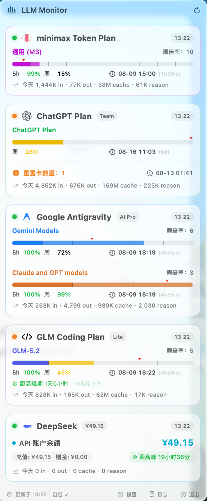
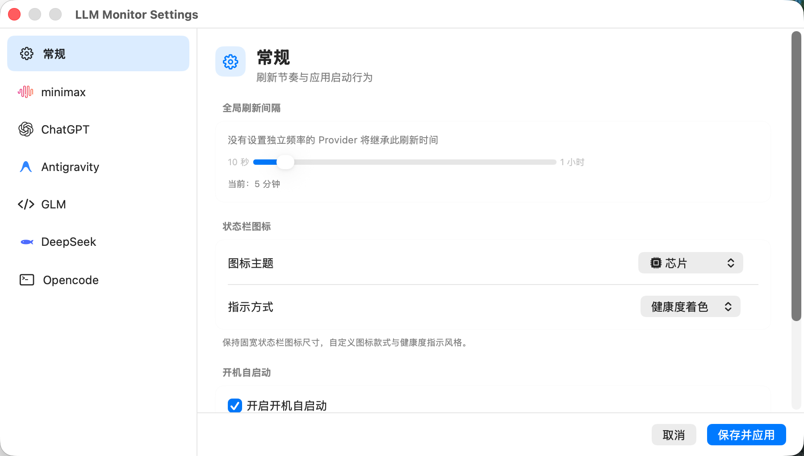
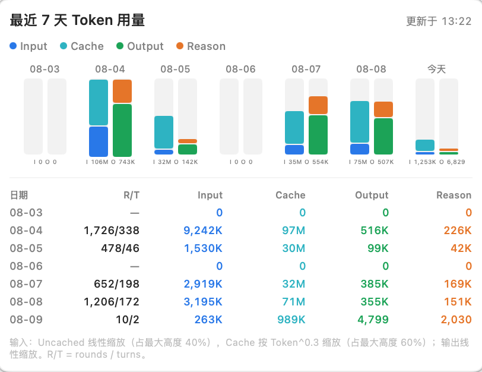

# LLM Monitor

**English** | [简体中文](README.md)

LLM Monitor is a macOS 14+ menu bar app for viewing quota, balance, reset times, health, and local token usage across multiple LLM services.

> Current version: **1.4.0** · Apple Silicon and Intel · Credentials and usage caches stay on your Mac

## Download

1. Download `LLM-monitor-1.4.0.dmg` from [GitHub Releases](https://github.com/bigboyq/LLM-monitor/releases/latest).
2. Open the DMG and drag **LLM-monitor.app** to **Applications**.
3. Launch the app, click its menu bar icon, open Settings, and enable the providers you use.

The public snapshot is ad-hoc signed and is not Apple-notarized. If macOS blocks the first launch, Control-click the app in Finder and choose **Open**. Install only artifacts from this repository's Releases page and verify them against `SHA256SUMS.txt`.

## Supported providers

| Provider | Remote data | Local usage | Authentication |
|---|---|---|---|
| Minimax Token Plan | Plan quota API | Minimax v2 SQLite; optional OpenCode merge | Token Plan API key |
| ChatGPT Plan / Codex | ChatGPT usage API | Codex session logs; optional OpenCode merge | `~/.codex/auth.json` |
| Antigravity | Local language-server RPC | Local trajectory metadata RPC; optional OpenCode merge | Existing Antigravity session |
| GLM Coding Plan | GLM quota API | ZCode SQLite; optional OpenCode merge | Coding Plan key |
| DeepSeek | Account balance API | Optional OpenCode merge | DeepSeek API key |

## Highlights

- Quota, balance, health, reset time, and manual refresh in one menu.
- Local token totals and seven-day charts for supported clients.
- Per-provider refresh intervals, exponential retry backoff, and live config reload.
- GLM and DeepSeek peak-period indicators.
- Optional OpenCode usage merging per provider.
- Launch-at-login support when the app is installed in `/Applications`.
- Private local storage: configuration directories use mode `0700`; config and log files use `0600`.

## Screenshots

<p align="center">
  
</p>

<p align="center"><sub>The menu bar dashboard combines provider quota, balance, reset time, peak-period status, and local usage.</sub></p>

<table>
  <tr>
    <td></td>
    <td></td>
  </tr>
  <tr>
    <td align="center">General settings and provider navigation</td>
    <td align="center">Seven-day token usage details</td>
  </tr>
</table>

## Documentation

- [English user guide](docs/help.en.md)
- [中文帮助文档](docs/help.zh-CN.md)
- [Architecture and provider specifications](spec/overview.md)
- [Changelog](CHANGELOG.md)

## Build from source

Requirements: macOS 14+, Xcode/Command Line Tools, and Swift 5.10 or newer.

```bash
git clone git@github.com:bigboyq/LLM-monitor.git
cd LLM-monitor
swift build
./.build/debug/LLM-monitor
```

Run the test and audit gates:

```bash
./scripts/test.sh
./scripts/audit.sh
```

Create a deterministic release app, DMG, and checksum file:

```bash
./scripts/build-release.sh 1.4.0 93
```

The default build is ad-hoc signed. For Developer ID signing and notarization, set `CODESIGN_IDENTITY`, `NOTARIZE=1`, and `NOTARY_PROFILE` as described in the comments in `scripts/build-app.sh` and `scripts/build-dmg.sh`.

## Privacy and security

API keys are sent only to their matching provider endpoints. The app does not copy credentials or local usage databases into this repository. Configuration, logs, and scanner caches are stored under the current user's home directory. See the [user guide](docs/help.en.md#privacy-and-local-files) for exact paths.
