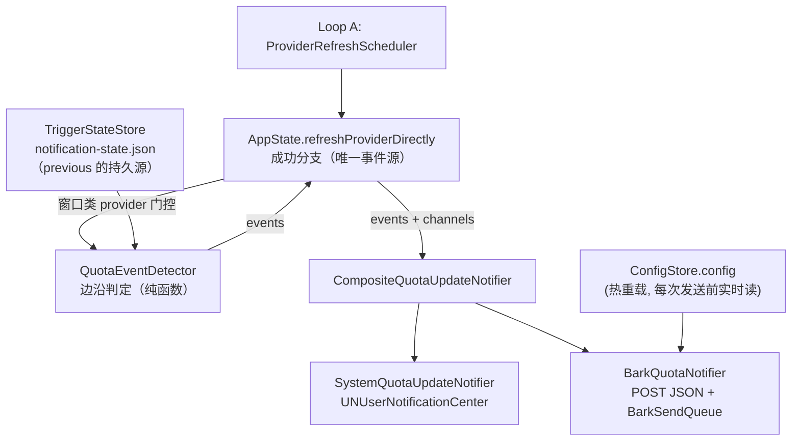

# LLM Monitor — 通知与推送模块（Notifications & Bark Push）

Status: 已实施（2026-09-13，融合 `feat/bark-notification` 分支与设计稿裁定）。
本文档是通知模块的规范：事件模型、触发语义、渠道层、屏幕跳过策略、配置 schema、
持久化基线与测试地图。历史设计推演（触发器纯函数架构草案）已被本实现取代，
余额阈值触发器为明确的 future work（见文末）。

## 1. 模块职责与边界

| 能力 | 状态 |
|---|---|
| 四类窗口事件通知（5h / 周 × 恢复 / 耗尽），渠道独立配置（不通知 / 系统通知 / Bark+系统通知） | ✅ |
| Bark 远程推送（POST JSON、覆盖 id、串行队列、冷却、重试、可取消） | ✅ |
| 「人在电脑前时跳过 Bark」（亮屏 + 未锁屏才跳过；显示器休眠或锁屏都推送） | ✅ |
| 检测基线持久化（跨重启连续，`notification-state.json`） | ✅ |
| 系统通知标题按事件类型 | ✅ |
| 余额阈值触发器（DeepSeek「低于 xx 元」） | ⏳ future work |
| 静默时段 / 免打扰窗口 | ⏳ future work |

产品边界：远程推送仅支持 Bark 渠道，不做 APNs 自建 / 第三方推送聚合
（`spec/overview.md` Out of Scope）。所有四类事件默认值向后兼容 1.4.2 行为：
恢复 → 系统通知，耗尽 → 不通知。

## 2. 架构



关键裁定：**检测的 previous 来自 `TriggerStateStore` 持久基线，而非内存
`statuses.lastSuccess`**。内存 lastSuccess 重启即丢，重启后第一刷会静默重建
基线，漏报停机期间发生的耗尽/恢复；持久基线让边沿检测跨重启连续，事件入口
也因此不需要透传 previous。UI 状态（statuses）与通知边沿状态（store）彻底解耦。

### 文件与职责

| 文件 | 职责 |
|---|---|
| `Services/QuotaUpdateNotifier.swift` | `QuotaNotifyChannel` / `QuotaNotificationKind` / `QuotaEvent` / `QuotaEventDetector` / `QuotaEventBatch` / `QuotaUpdateNotifying` 协议 + `Composite`/`Noop` + `SystemQuotaUpdateNotifier` |
| `Services/BarkNotifier.swift` | `BarkQuotaNotifier`（渠道实现 + 屏幕/锁屏判定 + 测试推送）+ `BarkSendQueue`（actor 串行队列） |
| `Services/TriggerStateStore.swift` | `QuotaSnapshot` / `QuotaWindowBaseline` / `TriggerStateStore`（MainActor 内存权威 + 250ms 合并原子写盘） |
| `Services/AppState.swift` | 刷新成功分支的事件源 + windowedKinds 门控 + notConfigured 时 reset 基线 |
| `Views/SettingsView.swift` | 「常规 > Bark 推送」全局节 + 各窗口类 provider「通知配置」节 |
| `Services/ConfigStore.swift` | `AppConfig.bark: BarkConfig?` + `ProviderConfig.notify*` 四字段 |

## 3. 事件模型与触发语义

### 3.1 能力门控

`ProviderKind.windowedKinds`（ProviderStatus.swift）= minimax / codex / antigravity / glm。
只有窗口类 provider 参与：

- 设置页渲染「通知配置」节（四行渠道 Picker）；
- 刷新成功分支运行 detector 并回写基线（AppState 门控）。

DeepSeek 不参与：余额被二值化为 0/100 percent，无窗口语义；其触发器（余额阈值）
是 future work，届时应走独立的判定路径而不是 percent 边沿。

### 3.2 四类事件判定（`QuotaEventDetector`）

按 `modelName.lowercased()` 匹配基线（冲突取 first，两侧一致）；只有两侧窗口都
`.present` 才比较；percent 先过 `isFinite`；首帧（无基线）与新出现的 model/window
不通知；耗尽状态下不重复通知。

| 事件 | 判定（2026-09-13 裁定） |
|---|---|
| `intervalRestored` / `weeklyRestored` | 回升 > 5pp（`restoredMinimumRise`），或 percent > 98%（`restoredHighWatermark`）**且严格回升**（`rise > 0` 守门：parked 在 100% 不算回升，否则闲置 provider 每刷必响） |
| `intervalExhausted` / `weeklyExhausted` | previous > 0.01% 且 current ≤ 0.01%（下穿边沿） |

> 字面公式 `new > 98 || new - old > 5` 的两个边界经用户确认：99→100（98+ 区间内
> 回升）**报**；但 parked 等值（100→100）必须不算"回升"，否则每次刷新都触发，
> 60s 冷却兜不住 300s 的刷新间隔——`rise > 0` 守门即为此而设，语义仍是"回升"。

渐进回升（如 20→30→45 跨两次刷新各 +10/+15）按公式逐次独立判定、每次都报，
60s 冷却兜底（裁定：不做"一次回升只报一次"的武装语义）。

### 3.3 基线生命周期（`TriggerStateStore`）

- **写入无条件**：窗口类 provider 每次成功刷新（merge 后的最终 `QuotaInfo`）都
  回写基线，与是否配置触发器无关——保证"先开监控、后开触发器"的边沿语义一致。
- **首帧不通知**：无基线时（冷启动首次 / 基线被 reset 后首次）只建基线不触发，
  防重启风暴。
- **reset 时机**：provider 转入 `.notConfigured`（禁用 / 凭证失效 / 外部 auth 缺失）
  时 `rebuildStatuses` 调 `reset(providerID:)`；重新配置后回到首帧语义。
- **抓取失败不评估也不回写**：`.loading/.failed` 携带的 lastSuccess 是旧数据。
- **落盘**：`notification-state.json`（config.json 同目录），250ms 合并窗口 +
  `FileManagerBox.writePrivate`（0600 / 临时文件 / fsync / rename 原子替换），
  坏文件容错降级为空；`AppState.stop()` 时 `flushNow()` 同步落盘。

## 4. 渠道层

### 4.1 渠道语义与合并

`QuotaNotifyChannel`：`.none` / `.system` / `.barkAndSystem`（Bark = 系统 + Bark 同时发）。
`QuotaEventBatch` 按模型分组，**每个渠道只包含路由到该渠道的事件文案**——
「不通知」的事件不会混进同模型其它渠道的通知（渠道过滤在 batch 层完成，两个渠道共用）。
一次刷新单模型单渠道至多一条通知；Bark 覆盖 id 为
`llmmonitor-{providerID}-{modelName}`（与事件组合无关，事件组合变化仍覆盖旧推送）。

### 4.2 系统通知（`SystemQuotaUpdateNotifier`）

- center 懒加载：裸 `swift run`（无 Bundle ID）安全禁用。
- 权限：启动时仅 `.notDetermined` 弹窗（`applicationDidFinishLaunching`）；发送时
  `.notDetermined` 现场补申请，`.denied` 静默跳过。
- `threadIdentifier = "quota-update-{providerID}-{modelName}"`（provider 维度，
  不同 provider 同名模型不串线程）；前台 `willPresent` 返回 `[.banner, .sound]`。
- 标题按事件类型：纯耗尽 →「{provider} 额度已用完」、纯恢复 →「额度已恢复」、
  混合 →「额度提醒」；正文 `messageLine`：恢复为「短周期/周额度 X% → Y%」，
  耗尽为「5 小时/周额度已用完（剩 X%）」。
- 60s 冷却（`groupsAfterCooldown`，内存表按 thread key）。

### 4.3 Bark（`BarkQuotaNotifier` + `BarkSendQueue`）

- 传输：`POST {server}/{key}`，JSON body（title/body/sound/group/id），规避 GET 的
  URL 编码与 2048 限制；server URL 的 base path 原样保留（反向代理子路径可用）。
  scheme 白名单：https + 本机 loopback http（`localhost`/`127.0.0.1`/`::1`）。
- 配置规范化（trim）先于校验与请求；`serverURL`/`deviceKey` 不全 → 渠道不可用，
  触发 `.barkAndSystem` 时降级为只发系统通知（不丢通知）。
- **屏幕跳过**（`skipWhenAwakeAndUnlocked`，2026-09-13 裁定）：

  | 状态 | Bark |
  |---|---|
  | 亮屏 + 未锁屏（人在使用） | 跳过 |
  | 显示器休眠 + 未锁屏（离开后闲置） | **推送** |
  | 锁屏（屏幕亮或休眠） | **推送** |

  判定 `screenInActiveUse = !CGDisplayIsAsleep(...) && !kCGSSessionScreenIsLocked`；
  查询失败保守按"人在使用"处理（宁漏 Bark 不误发）。系统通知不受此开关影响。
  测试推送复用同一谓词。
- **发送队列**（actor）：单并发串行 + 有界积压 10（溢出按冷却键合并保留最新，
  不丢模型）+ 同模型 60s 冷却（**发送成功才**写冷却表，失败/取消不占冷却）+
  5xx / 瞬时网络错误（timeout / 断连 / DNS 等）重试一次（1s 退避）+ 代际取消
  （`cancelAll` 递增代际使旧 drain 失效；`draining` 标记同步复位，避免
  `awaitIdle` 永挂）。App 退出（`applicationWillTerminate`）取消未完成推送。
- 日志脱敏：不回显 device key / 完整 URL / 自建服务响应体。

## 5. 配置 Schema（config.json）

`schemaVersion` 维持 2；全部字段 optional、缺失即默认；渠道枚举坏值按缺失处理
（`try? + rawValue` 容错），不进损坏恢复流程。

```jsonc
{
  "schemaVersion": 2,
  "bark": {                                  // 全局 Bark 配置，整块 optional（do/catch 容错）
    "enabled": true,
    "serverURL": "https://api.day.app",
    "deviceKey": "…",
    "sound": "minuet",                       // 可选
    "skipWhenAwakeAndUnlocked": true,        // 可选，nil = 不跳过
    "group": "LLMMonitor"                    // 可选，nil = 不携带 group
  },
  "providers": {
    "codex_chatgpt": {
      "enabled": true,
      "notifyIntervalRestored": "system",    // none | system | barkAndSystem
      "notifyIntervalExhausted": "off",
      "notifyWeeklyRestored": "system",
      "notifyWeeklyExhausted": "off"
    }
  }
}
```

- 默认值唯一来源是 `QuotaNotifyChannels.channel(for:)`；保存时与默认一致写 nil
  （`ProviderConfig.setNotifyChannel`），保持 config.json 干净。
- notify* 字段对非窗口类 provider（DeepSeek）无语义；UI 不渲染、detector 不评估。

## 6. 设置 UI

- **全局**（设置 > 常规 > 「Bark 推送」节）：启用开关、服务端地址、Device Key
  （SecureField + 显示开关）、铃声、分组、「人在电脑前时跳过推送」、发送测试推送
  （读当前草稿、复用规范化/构造/屏幕策略、绕过队列冷却、行内返回结果文案）。
- **每 Provider**（窗口类 pane 顶部、「认证与刷新」之前）：「通知配置」节，四行
  `QuotaNotificationKind` × 渠道 Picker（不通知 / 系统通知 / Bark + 系统通知），
  key = providerID 的字典草稿，`saveAndApply` 走 `setNotifyChannel` 归一化。
- 保存路径与既有设置一致（草稿 + `SettingsSaveTransaction` 事务），无新增事务边界。

## 7. 测试地图（XCTest）

| 文件 | 覆盖 |
|---|---|
| `QuotaUpdateNotifierTests.swift` | detector 边沿（首帧/新窗口/absent/浮点噪声）、恢复阈值边界（0→3 不报、10→20 报、96→100 报、99→100 报、100→100 不报）、耗尽边沿、渠道默认兼容、thread provider 维度、系统通知 60s 冷却、`setNotifyChannel` 归一化、AppState 两快照集成（配置透传 + 首帧不通知） |
| `BarkNotifierTests.swift` | POST JSON 构造、base path 保留、scheme 白名单、规范化、按渠道过滤、按模型拆分与稳定覆盖 id、人在电脑前跳过矩阵、冷却（成功才生效）、5xx/瞬时重试一次、非瞬时不重试、积压取消（确定性时序：入队齐 → cancelAll → 释放 hold → awaitIdle）、溢出按模型合并、测试推送复用正式参数、BarkConfig 容错解码 |
| `TriggerStateStoreTests.swift` | 跨实例 roundtrip、detector 消费重载基线补报停机事件、快照 key 冲突取 first、reset 后重载为空、坏文件降级 |

测试基础设施注意：`RecordingURLProtocol` 的记录与 `onReceive` 回调发生在请求
**进入**时（先于 hold），否则被 hold 的请求会让 expectation 等到 5s 信号量超时，
且滞留的 startLoading 会把记录串扰进下一个测试窗口（本次曾引入两个 flaky）。
涉及冷却 / 取消的断言先 `await sendQueue.awaitIdle()`（或先等积压齐再 cancel），
不依赖固定 sleep 判"有"，固定 sleep 仅用于判"无"。

## 8. Future Work

1. **余额阈值触发器**（DeepSeek「低于 xx 元」）：独立判定路径（`balanceDetail.total`
   下穿边沿 + 回弹重置武装），config 增 `balanceThreshold`/`balanceChannel`，
   DeepSeek pane 增行；不走 percent 窗口边沿。
2. 静默时段 / 免打扰窗口（`lastFiredAt` 数据已就绪）。
3. Bark 进阶参数（`level`：timeSensitive 穿透专注模式 / 自定义 icon）。
4. 屏保运行（亮屏+未锁）当前按规则跳过 Bark，但用户同样看不到系统通知——
   如需覆盖可引入 `NSWorkspace` 屏保状态。

## 9. 实施记录

- 分支 `tsh/feat/bark-notification`（同事实现：通知器抽象、四类事件、Bark 渠道、
  设置页、R1-R8 评审修复）为基座；本分支 `feat/bark-merged` 叠加：
  恢复公式重裁定（98/5 + 严格回升守门，替换 0.01 增幅）、屏幕跳过谓词重裁定
  （亮屏+未锁屏组合，替换单一锁屏信号）并改名 `skipWhenAwakeAndUnlocked`、
  `TriggerStateStore` 持久基线（换掉内存 previous）、windowedKinds 检测门控、
  系统通知标题按事件类型、`BarkSendQueue.cancelAll` 的 `draining` 复位修复、
  测试桩回调时机修复（消 flaky）。
- 决策记录：屏幕跳过语义与恢复公式阈值见 §3.2 / §4.3 的裁定标注（2026-09-13）；
  余额触发器延后（裁定）。
