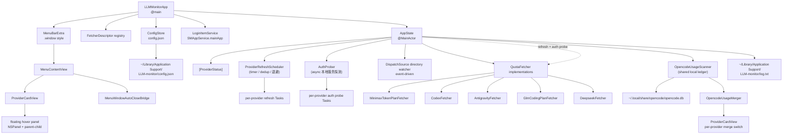

# LLM Monitor — Project Spec

macOS menu bar app for watching remaining LLM service quota. The app is intentionally passive: it lives in the menu bar, reads a local JSON config, refreshes quota in the background, and shows the latest status when the menu is opened.

## Current Scope

| Area | Current behavior |
|---|---|
| Platform | macOS 14+, SwiftUI `MenuBarExtra` |
| Build system | Swift Package Manager executable target (with `LLMMonitorTests` test target) |
| UI model | Menu bar drop-down plus a native Settings window; lightweight setup guidance appears when all providers are unconfigured |
| Hover details | Delayed floating hover panels for compact quota details |
| Login item | Settings-window launch-at-login toggle backed by `SMAppService.mainApp`; menu footer is read-only |
| Config | `~/Library/Application Support/LLM-monitor/config.json`, JSON, permission `0600` |
| Instance | One process per user config directory, enforced by `instance.lock` |
| Runtime log | `~/Library/Application Support/LLM-monitor/log.txt` plus stdout and `os.Logger` (privacy `.private`, Console.app 默认脱敏) |
| Providers | `minimax_token_plan`, `codex_chatgpt`, `antigravity`, `glm_coding_plan`, `deepseek` |
| Refresh | Independent timer per enabled provider |
| Config reload | Event-driven via `DispatchSourceFileSystemObject` (no polling) |
| Window lifetime | Menu closes on focus loss or after 30s of inactivity; any in-menu interaction resets the timer |

## Design Goals

1. **Low interruption** — the app never takes focus unless the user opens the menu.
2. **Local config with a native editor** — settings can edit supported provider fields, while `config.json` remains directly editable and reloads through filesystem events.
3. **Provider isolation** — each provider fetches independently; one slow or failing provider should not block the others.
4. **Auditable config** — API keys and provider settings live in a readable JSON file that can be diffed or managed by dotfiles.
5. **Graceful failure** — failed fetches show an error and keep the last successful quota in memory.
6. **Small provider surface** — adding a provider should mean implementing one `QuotaFetcher`, adding one `ProviderKind`, and registering one descriptor.

## Source Map

| Path | Responsibility |
|---|---|
| `Sources/LLM-monitor/LLMMonitorApp.swift` | App entry point, lifecycle delegate, `FetcherDescriptor` registry, fixed menu bar label |
| `Sources/LLM-monitor/Services/AppInstanceLock.swift` | Per-user single-instance lock held for the process lifetime |
| `Sources/LLM-monitor/Models/FetcherDescriptor.swift` | `FetcherDescriptor` (provider 注册元信息 single source of truth) |
| `Sources/LLM-monitor/Models/ProviderStatus.swift` | UI-facing provider state + `ProviderKind` / `AccentColor` 枚举 |
| `Sources/LLM-monitor/Models/QuotaInfo.swift` | Provider-neutral quota 和 reset-credit 模型 |
| `Sources/LLM-monitor/Models/AnyJSON.swift` | 弱类型 JSON（Antigravity 递归解析用） |
| `Sources/LLM-monitor/Models/LocalUsageDaily.swift` | Antigravity / Codex / Minimax / GLM / OpenCode 共享的 7-day chart 协议 + 默认实现 |
| `Sources/LLM-monitor/Models/OpencodeLocalUsage.swift` | OpenCode provider 分片、今日 / 7 天聚合与逐次 samples |
| `Sources/LLM-monitor/Models/OpencodeUsageMerger.swift` | OpenCode 与各 Provider 的字段级合并和 token 语义转换 |
| `Sources/LLM-monitor/Models/AntigravityLocalUsage.swift` | Antigravity 本地用量数据模型 |
| `Sources/LLM-monitor/Models/MinimaxLocalUsage.swift` | minimax 本地用量数据模型 |
| `Sources/LLM-monitor/Fetchers/QuotaFetcher.swift` | `QuotaFetcher` protocol + 默认实现 |
| `Sources/LLM-monitor/Fetchers/QuotaError.swift` | 统一错误类型 |
| `Sources/LLM-monitor/Fetchers/MinimaxTokenPlanFetcher.swift` | minimax Token Plan API 抓取 |
| `Sources/LLM-monitor/Fetchers/CodexFetcher.swift` | ChatGPT Plan API 抓取 + 本地 JSONL 解析 |
| `Sources/LLM-monitor/Fetchers/AntigravityFetcher.swift` | Antigravity 进程发现 + 本地 RPC + protobuf-like 解析 |
| `Sources/LLM-monitor/Fetchers/GlmCodingPlanFetcher.swift` | GLM Coding Plan 额度与 reset time 抓取 |
| `Sources/LLM-monitor/Fetchers/DeepseekFetcher.swift` | DeepSeek 账户余额抓取（`/user/balance`）+ 解析 |
| `Sources/LLM-monitor/Models/GlmPeakWindow.swift` | GLM 可配置高峰窗口（本机时区）判定 |
| `Sources/LLM-monitor/Models/DeepseekPeakWindow.swift` | DeepSeek 高峰窗口（北京时间 + 周末平价开关）判定 |
| `Sources/LLM-monitor/Services/AppState.swift` | 全局状态派生、config watcher、scanner wire-up、per-provider 协调（timer / auth probe / 本地 scanner 都委托给专门类） |
| `Sources/LLM-monitor/Services/AppLog.swift` | stdout / 文件 (5MB rotate) / os.Logger (`.private`) 三路日志 |
| `Sources/LLM-monitor/Services/ConfigStore.swift` | config.json 读写 + 内容指纹跟踪 + 模板生成 |
| `Sources/LLM-monitor/Services/LoginItemService.swift` | `SMAppService.mainApp` 包装 + 状态显示 |
| `Sources/LLM-monitor/Services/Formatters.swift` | token / percent / 时间 / codex window 标签格式化 |
| `Sources/LLM-monitor/Services/HTTPClient.swift` | 共享 HTTP 客户端（minimax / codex 三个 fetch 路径） |
| `Sources/LLM-monitor/Services/LocalUsageCoordinator.swift` | scanner 协议 + Combine wire-up 容器 |
| `Sources/LLM-monitor/Services/ProviderRefreshScheduler.swift` | per-provider timer + in-flight dedup + 退避 + 失败计数（5 个 dict） |
| `Sources/LLM-monitor/Services/AuthProber.swift` | 异步探测本地服务（antigravity）是否还活着 + 缓存 + 离/在线变化回调 |
| `Sources/LLM-monitor/Fetchers/RefreshResultMergers.swift` | `CodexFillingMissingMerger` 等 per-provider 合并策略（Minimax 使用默认 `IdentityRefreshResultMerger`） |
| `Sources/LLM-monitor/Services/DateParser.swift` | ISO8601 / unix timestamp 统一解析 |
| `Sources/LLM-monitor/Services/StringUtilities.swift` | 字符串小工具（trim / firstTrimmed） |
| `Sources/LLM-monitor/Services/LocalUsageDayKey.swift` | `yyyy-MM-dd` day key（跟 SQLite `strftime` 对齐） |
| `Sources/LLM-monitor/Services/SQLiteConnection.swift` | SQLite3 通用连接层（init / open / query） |
| `Sources/LLM-monitor/Services/SQLiteTempCopy.swift` | CANTOPEN/BUSY 时 `/tmp` 副本 fallback |
| `Sources/LLM-monitor/Services/Color+Theme.swift` | 品牌色常量 |
| `Sources/LLM-monitor/Services/MenuBarRightClickHandler.swift` | 状态栏按钮右键菜单（best-effort） |
| `Sources/LLM-monitor/Services/MinimaxDBReader.swift` | 读 minimax v2 `local_runtime_token_usage` 表 |
| `Sources/LLM-monitor/Services/MinimaxLocalUsageScanner.swift` | minimax v2 `runtime-state.sqlite` 单源 scanner（AsyncMutex + lastCommittedGeneration 串行化）|
| `Sources/LLM-monitor/Services/GlmZcodeLocalUsageScanner.swift` | GLM ZCode `db.sqlite` 单源 scanner（AsyncMutex + lastCommittedGeneration 串行化） |
| `Sources/LLM-monitor/Services/AntigravityLocalUsageScanner.swift` | Antigravity 纯 RPC 架构 scanner（AsyncMutex + lastCommittedGeneration 串行化，不用 SQLite .db 读表）|
| `Sources/LLM-monitor/Services/OpencodeDBReader.swift` | 读取 OpenCode `message` 表并按 provider / day 聚合 |
| `Sources/LLM-monitor/Services/OpencodeUsageScanner.swift` | OpenCode DB 指纹、缓存、7 天窗口与 provider slice snapshot |
| `Sources/LLM-monitor/Services/AsyncMutex.swift` | actor-based async-aware mutex（scanner pipeline 互斥；支持 caller cancellation propagation — acquire 前 / 排队中 / acquire 后执行前三阶段均检查取消）|
| `Sources/LLM-monitor/Services/CancellationFilter.swift` | 统一"取消错误"判断（`Task.isCancelled` / `CancellationError` / `URLError.cancelled`），三处 catch 共用 |
| `Sources/LLM-monitor/Services/FileManagerBox.swift` | `FileManager` 的 `@unchecked Sendable` 包装 + `fileManager` 字段 `private`（同文件 extension 之外不能直接拿到底层 `FileManager`）。`Tests/.../AccessCheck.swift` 是 tripwire 验证 access 没被改松 |
| `Sources/LLM-monitor/Services/HTTPTimeouts.swift` | HTTP timeout 集中地（之前散落在 minimax/codex/antigravity 三个 fetcher），改一处全局生效 |
| `Sources/LLM-monitor/Services/LocalUsageScanRunner.swift` | 本地用量 scanner 共享的 lifecycle helper（generation 守门 / cancellation filter / defer generation 守门），消除镜像 boilerplate |
| `Sources/LLM-monitor/Views/MenuContentView.swift` | 主面板（header / content / footer） |
| `Sources/LLM-monitor/Views/MenuWindowAutoCloseBridge.swift` | 失焦立即关 + 30s 无交互关闭（菜单内 mouse/scroll/key 重置计时）|
| `Sources/LLM-monitor/Views/ProviderCardView.swift` | provider 卡片 + `StatusIndicator` + `ProviderStateLabel` + `QuotaSummary` |
| `Sources/LLM-monitor/Views/QuotaViews.swift` | 各种 quota 行 + 进度条 + `EquivalentQuotaAllocation` |
| `Sources/LLM-monitor/Views/HoverPanel.swift` | `HoverInfoRow` / `HoverPanelController` / 浮层管理 |
| `Sources/LLM-monitor/Views/TokenChart.swift` | 7-day 柱图基础组件（`StackedTokenBar` / `TokenChartScale`） |
| `Sources/LLM-monitor/Views/AntigravityAccountView.swift` | Antigravity / ChatGPT 账号 hover 详情 |
| `Sources/LLM-monitor/Views/DeepseekAccountView.swift` | DeepSeek 余额 hover 详情（充值 / 赠金明细） |
| `Sources/LLM-monitor/Views/GlmPeakIndicatorView.swift` | GLM 高峰期提示行（倒计时 + 三档颜色） |
| `Sources/LLM-monitor/Views/DeepseekPeakIndicatorView.swift` | DeepSeek 高峰期提示行（北京时间倒计时，内嵌余额行右侧） |
| `Sources/LLM-monitor/Views/PeakIndicatorView.swift` | 高峰提示行公共组件（`TimelineView` 外壳 + `formatDuration`，GLM / DeepSeek 共用） |
| `Sources/LLM-monitor/Views/BrandLogoView.swift` | provider 品牌 logo 资源加载 + SF Symbol fallback |
| `Sources/LLM-monitor/Views/LocalUsageHoverViews.swift` | 7-day 泛型 chart + 泛型 footer |
| `Sources/LLM-monitor/Views/SettingsView.swift` | 设置面板 |
| `scripts/build-app.sh` | Release universal `.app` bundle build 和 ad-hoc signing |
| `scripts/build-dmg.sh` | DMG packaging from the built `.app` |
| `scripts/test.sh` | 运行 `swift test`；仅显式设置 `INCREMENT_BUILD_NUMBER=1` 时递增 build 编号 |
| `scripts/audit.sh` | Shell syntax、Package、测试、Release 和 Swift 6 门禁 |
| `scripts/archive-source.sh` | 从 Git HEAD 生成源码归档 |
| `scripts/export-antigravity-quota.sh` | 导出 Antigravity 本地 quota 数据 |
| `scripts/generate-icns.sh` | 生成应用图标资源 |

## Architecture



## Config Schema

The app reads and writes this shape:

```json
{
  "schemaVersion": 1,
  "refreshIntervalSeconds": 300,
  "providers": {
    "minimax_token_plan": {
      "enabled": false,
      "apiKey": "sk-cp-REPLACE-WITH-YOUR-KEY"
    },
    "codex_chatgpt": {
      "enabled": false,
      "authPath": "~/.codex/auth.json"
    },
    "antigravity": {
      "enabled": false
    },
    "glm_coding_plan": {
      "enabled": false,
      "apiKey": "REPLACE-WITH-YOUR-CODING-PLAN-KEY"
    },
    "deepseek": {
      "enabled": false,
      "apiKey": "sk-REPLACE-WITH-YOUR-KEY"
    }
  }
}
```

首次启动模板默认关闭所有 provider，避免占位 Key 被误认为已配置。菜单中会显示“打开设置”引导；配置真实凭据后再启用对应 provider。上表是 `ConfigStore.writeTemplate` 实际生成的模板默认值（见 `ConfigStore.templateProviders()`）。

`refreshIntervalSeconds` 除了顶层全局默认，还可以在每个 provider 下**可选覆盖**。模板默认不写该字段，下面是一个让 Codex 每 60 秒刷新一次的自定义示例（并非模板默认值）：

```json
"codex_chatgpt": {
  "enabled": true,
  "authPath": "~/.codex/auth.json",
  "refreshIntervalSeconds": 60
}
```

| Field | Scope | Meaning |
|---|---|---|
| `schemaVersion` | global | Configuration schema version. Missing legacy values decode as version 0 and are normalized to the current version; unsupported future versions are rejected rather than silently defaulted. |
| `refreshIntervalSeconds` | global | Default refresh interval in seconds. Current default is `300`; effective values are clamped to 10 seconds...30 days. |
| `providers.<id>.enabled` | provider | Disabled providers stay visible but are not fetched. Missing `enabled` decodes as `true`. |
| `providers.<id>.apiKey` | provider | API key for providers that do not manage external auth. Used by minimax. |
| `providers.<id>.displayName` | provider | Optional UI label override. |
| `providers.<id>.refreshIntervalSeconds` | provider | Optional provider-specific timer interval, with the same 10-second...30-day clamp. |
| `providers.<id>.authPath` | provider | External-auth path used by Codex. Accepts either an `auth.json` file path or its parent directory. |
| `providers.<id>.mergeOpencodeUsage` | Minimax / ChatGPT / Antigravity / GLM / DeepSeek | Whether to add the matching OpenCode provider slice to the card's local token data. Missing means `true` for GLM and `false` for the other providers. |

`ProviderConfig.encode(to:)` omits nil optional fields, so saved config only includes relevant keys. `ConfigStore.saveConfig()` writes pretty-printed, sorted-key JSON and reapplies `0600`.
Unknown or incorrectly typed `statusBarIconStyle` / `statusBarIndicatorMode` values fall back
to their defaults; cosmetic config errors do not trigger recovery of the provider settings.

OpenCode is a shared local data source rather than a fifth menu-bar provider. Its
provider mapping and merge semantics are documented in [`spec/providers/opencode.md`](providers/opencode.md).

## Startup Flow

1. `LLMMonitorApp.init()` acquires the per-user `instance.lock`; a second instance exits without touching shared state.
2. `LLMMonitorApp.init()` creates `ConfigStore`.
3. `ConfigStore` creates the app support directory if needed.
4. If `config.json` is missing, `ConfigStore.writeTemplate(to:)` writes the built-in template.
5. `ConfigStore` loads JSON into `AppConfig`; if an existing file cannot be decoded, it is backed up as `config.json.corrupt-*.json` before recovery continues with `.default`.
6. `LLMMonitorApp.makeDescriptors()` registers the built-in providers.
7. `ConfigStore.ensureProvidersPresent(descriptors:)` adds missing provider blocks without overwriting existing blocks.
8. `LoginItemService` snapshots the current launch-at-login status from `SMAppService.mainApp`.
9. `AppState` derives `ProviderStatus` values from descriptors plus config.
10. `AppState.start()` schedules one refresh task per enabled provider that has usable auth.
11. `AppState.startConfigWatcher()` opens the config directory via `open(O_EVTONLY)` and installs a `DispatchSource.makeFileSystemObjectSource` listener — config edits trigger an event-driven reload in milliseconds (no polling).

The lifecycle delegate calls `AppState.stop()` during normal application termination
and triggers an immediate `refreshAll()` after `NSWorkspace.didWakeNotification`,
so sleep/wake does not leave quota cards stale until the next configured timer tick.

## Provider State Machine

```swift
enum State {
    case notConfigured(reason: String)
    case ready
    case loading(lastSuccess: QuotaInfo?)        // 抓取中,lastSuccess 兜底
    case ok(QuotaInfo)                          // 抓取成功
    case failed(message: String, lastSuccess: QuotaInfo?)
}
```

`State` 自身持有"上次成功数据" —— `.loading(lastSuccess:)` / `.failed(_, lastSuccess:)`
/ `.ok(info)` 三种 case 都能从 `state.lastSuccess` 拿到 QuotaInfo?。**没有**单独的
`_lastSuccess` 字段（之前有过，跟 `.failed.lastSuccess` 重复存，迁 `.ok → .loading →
.ok/.failed` 任意一处忘记更新就会让 UI 跟 `healthLevel` 不一致，已删）。

State derivation is descriptor-driven:

| Situation | State |
|---|---|
| Provider block missing from config | `.notConfigured("未在 config.json 中配置")` |
| `enabled == false` | `.notConfigured("已在 config.json 中禁用")` |
| API-key provider has empty/template key | `.notConfigured("API Key 未填写")` |
| External-auth provider has no local auth file | `.notConfigured("外部 auth 缺失：...")` |
| Antigravity local session missing | `.notConfigured("请先启动 Antigravity 并完成登录")` |
| Config and auth are present | `.ready` |
| Fetch in progress | `.loading(lastSuccess: prev)` |
| Fetch succeeds | `.ok(info)` |
| Fetch fails | `.failed(message, lastSuccess: prev)` |

`rebuildStatuses` 在 config 变更时被调用。如果 deriveState 返回 `.ready`（auth 还 ok），
旧 status 的 `.ok/.loading/.failed` 状态会**整体复用**（auth 没变就不擦数据）；
deriveState 返回 `.notConfigured` 时整个 state 重置，lastSuccess 跟着清。

`rebuildStatuses()` preserves the entire `State` (`.ok/.loading/.failed`) by provider id when auth is still valid (derived is `.ready`), so config reloads do not erase the last successful snapshot. When auth becomes invalid (derived is `.notConfigured`), state resets to `.notConfigured` and the QuotaInfo data is dropped.

## Refresh Behavior

每个 enabled provider 由 `ProviderRefreshScheduler` 管理独立 timer：

1. scheduler 立即调用 `refreshHandler(providerID, .full)` → AppState 的 `refreshProviderDirectly`
2. 成功后 sleep `providers.<id>.refreshIntervalSeconds ?? refreshIntervalSeconds`（后续轮询用 `.background` mode）
3. 失败走指数退避（`baseInterval × 2^failures`，cap 5 次，30 分钟封顶，±10% jitter）
4. 任务被 cancel → 退出循环

scheduler 集中持有 5 个 dict：`tasks` / `inFlightModes` / `inFlightWaiters` / `nextRefreshDates` / `failureCounts`。
in-flight dedup：`markInFlight(providerID)` 返回 false 时直接 `.deferred`（已被 timer /
manual / menu-open 任一路径占住）。手动 full refresh 若遇到 background 请求，会通过
`waitUntilNotInFlight` 等待；该等待支持 cancellation，取消时会移除带 UUID 的 waiter，
不会留下悬挂 continuation。多个 full refresh waiter 由 `pendingFullRefreshIDs` 做一次性
claim，当前 background 请求完成后最多补跑一次 full refresh。
成功 / 失败时 `recordSuccess(providerID)` / `recordFailure(providerID)` 计入 failureCounts。
UI 通过 `earliestNextRefresh` 拿到所有 provider 中最早的下次触发时间，pub 到 `nextRefreshAt`。

`AppState.refreshProviderDirectly` 是 scheduler 的 refreshHandler 闭包：
1. 入口 `markInFlight` dedup，失败 `.deferred` 退出
2. fetch + 应用到 `statuses[idx]` + 通知 `statusDidChange` 广播
3. `defer { markNotInFlight }` 在 `await` 路径任何退出都执行
4. 失败时调 `recordFailure` + antigravity 走 `AuthProber.scheduleProbe` 重新探测
5. config 变更时 generation mismatch 直接丢弃旧结果

The `effectiveRefreshInterval(for:)` helper clamps the interval to `10s...30d` to prevent
busy loops from typos (`0` or negative) and integer-conversion overflow from extreme values
in `config.json`.

Manual refresh paths:

| UI action | Method |
|---|---|
| Header refresh button | `AppState.refreshAll()` |
| Card context menu "立即刷新" | `AppState.refreshOne(providerID:)` |
| Menu open with any `.ready` provider | `MenuContentView.onAppear` triggers `refreshAll()` |
| Right-click menu bar icon | `MenuBarRightClickHandler.refreshClicked` |

`refreshAll()` starts one child task per refreshable provider. `ProviderRefreshScheduler.markInFlight`
deduplicates so timer + manual + menu-open fire on the same provider collapse to a
single in-flight request. Status mutations remain on the main actor; network waits are
asynchronous.

Config reload path:

1. `AppState.startConfigWatcher()` opens the config directory and installs a
   `DispatchSource.makeFileSystemObjectSource` listener.
2. On any write event, the handler calls `configStore.hasChangedSinceLastRead()` and
   then `configStore.reload()` to parse the file.
3. If parsing succeeds, the `configStore.$config` Combine publisher fires,
   `configurationGeneration` increments, statuses rebuild, and all provider timers
   reschedule.
4. In-flight fetches captured the *previous* `configurationGeneration`; when they
   complete, the captured value is compared and stale results are dropped.
5. If parsing fails during reload, `ConfigStore` keeps the previous config.

## Per-Provider Result Merge

每个 fetcher 自带 `resultMerger: RefreshResultMerger` —— policy 跟 fetcher domain knowledge
放一起，AppState 不再写 `if kind == .minimaxTokenPlan { ... }` 之类的分支：

| Fetcher | Merger | Behavior |
|---|---|---|
| `MinimaxTokenPlanFetcher` | `MinimaxVideoPreservingMerger` | `.background` 模式 + previous 有 video model → 沿用上次的 video（消耗极低，< 3 次/天） |
| `CodexFetcher` | `CodexFillingMissingMerger` | `resetCredits` / `codexUsageDetails` 缺失时回退到上次（避免 UI 空白） |
| `AntigravityFetcher` | `IdentityRefreshResultMerger`（默认） | 直接用新值 |

AppState.fetch 成功后调 `fetcher.resultMerger.merge(new:previous:mode:)` 合成最终值。

## Auth Probing

Antigravity 是用本地 Antigravity IDE / agy CLI 的 `language_server`，进程可能中途崩。
`AuthProber` 异步探测 `fetcher.checkLocalAuth()` 并缓存结果：

- `scheduleProbe(for: providerID)`：启动探测（fetcher.hasLocalAuth() false 时不发）
- `markAvailable(providerID)`：refresh 成功路径直接标记可用
- `isUnavailable(providerID)`：用于 `rebuildStatuses` 派生 `.notConfigured("请先启动 Antigravity...")`
- `reset()`：config 变更时清空 cache + 取消所有 in-flight
- `cancelAll()` / `cancel(providerID:)`：stop / schedule 同 provider 前的清理

`onChange` 回调在 cache 值变化时触发，AppState 收到 `false` 立刻 `rebuildStatuses + rescheduleAll`
让 UI 立即显示离线提示；`true` 不在 callback 里 rebuild（依赖下次 refresh 成功后的 markAvailable）。

## Scanner Concurrency (本地用量 scanner 的并发模型)

`MinimaxLocalUsageScanner` / `AntigravityLocalUsageScanner` 的缓存写入并发安全靠
**三层防御** 叠加：

1. **`inFlightTask` dedup**（`@MainActor` instance 状态）—— `scan()` 入口检查
   `inFlightTask == nil`，已有 in-flight 就直接 return. 正常路径下保证"同时间最多一个
   worker". cancel + rescan 是唯一会并发的场景.

2. **`AsyncMutex` pipeline 串行化**（actor-based async-aware mutex,
   `Services/AsyncMutex.swift`）—— 整个 `performScanPure` 包在
   `try await pipelineMutex.withLock { ... }` 里. 旧 worker 跑完整个 pipeline
   （包括 saveIndex）才让新 worker 开始, 杜绝 "两个 worker 并发 loadIndex/saveIndex
   导致 cache revert".

3. **`lastCommittedGeneration` 守门**（`@MainActor private var`, 每个 scanner
   实例独立; `performScanPure` 在 `AsyncMutex` 内部跨 `@MainActor` hop 调
   `await scanner.readLastCommittedGeneration()` 读 + `await scanner.writeLastCommittedGeneration(...)`
   写, 整个 read + write-to-disk + update 都在 mutex 内 atomic）—— 旧 worker
   即使晚到 mutex, 读到的也是新 worker 更新过的值, shouldSave=false 跳过
   saveIndex, 磁盘保留新 worker 的 view. **P1 fix**: 之前用 `lastCommittedAtStart`
   快照从 main actor 传入, 跟 mutex 内的 write 跨 await 拆分, 会有 "新 worker
   写盘后, 旧 worker 在 mutex 外读 stale 值, 进 mutex 后用 stale 值判断
   shouldSave=true, 写 A_view 回滚 B_view" 的回归. 修法: 把 read 移回
   mutex 内, 跨 @MainActor 边界 hop (`await scanner.read...`) 持锁执行.
   三层缺一不可:
   - 没 dedup: 正常路径就 race
   - 没 AsyncMutex: cancel+rescan 期间 race
   - 没 lastCommittedGeneration (在 mutex 内): 旧 worker 晚到 mutex 时回滚新 worker 的 cache

`runScan` 端还有 `startedGeneration == latestGeneration` 守门, 负责旧 worker 的
`in-memory result` 不写到 `self.lastResult`（保护 UI）. 三个守门各管一段, 不重叠.

GLM ZCode scanner 是有意的**全量快照模型**：它每次从同一个数据库重建完整 snapshot，
并由 `inFlightTask` + `AsyncMutex` + `runScan` generation 守门保护；它不使用
`lastCommittedGeneration`，因为没有 Minimax/Antigravity 那种按 source 增量合并后可能回滚
其他 source 的 cache view 的路径。这个差异是设计选择，不是遗漏的第三层。

**本地用量 scanner 共享的 lifecycle 抽到 `LocalUsageScanRunner`**（`Services/LocalUsageScanRunner.swift`）：
- `scan()` / `cancelInFlight()` / `runScan()` 的 boilerplate（启动 / 完成 generation
  检查、cancellation filter、applyResult / applyError 闭包注入）走 runner
- 各自 scanner 只实现"具体 work"（mutex + `performScanPureImpl`）跟"defer 块清
  isScanning / inFlightTask"
- 之前各 scanner 有约 80 行镜像 lifecycle 代码，现在各约 50 行
- `LocalUsageScanRunner.run` 是 enum 静态函数（不是 class），从 `await
  MainActor.run { latestGeneration() }` 拿 scanner 的 generation — 不引入
  新的 actor / state 污染各 scanner 独立的状态机
- **不**抽 base class / 不**改** `performScanPure` 签名 — 测试 surface
  （`testGate` / `performScanPure`）保留，避免大改测试

**Minimax / Antigravity 两个 provider 的 apply 路径抽到 `AppState.applyLocalUsage`**：
- `applyAntigravityLocalUsage` / `applyMinimaxLocalUsage` 99% 一样（`providerID` 查表 +
  no-op 检查 + `mutateStatus` 写入），原本是镜像重复。
- 抽到 `applyLocalUsage<T: Equatable>(kind:field:fieldName:summarize:usage:)`：
  - 用 `WritableKeyPath<ProviderStatus, T?>` 让 set 路径走类型系统，避免每次写闭包
  - `summarize` closure 让调用方按"X sessions" / "X events" 等不同口径打印日志摘要
    （避免 dump 完整 7-day daily 数组，污染 debug 日志）
  - 派生自 `ProviderKind.logTag`（新加的 short tag，跟 fetcher `logTag` 约定一致）

**`AntigravityLocalUsage` / `MinimaxLocalUsage` 自定义 `==` 排除 `scannedAt`**：
- 默认 Equatable 因 `scannedAt: Date?`（每次扫描都是新 `Date`）让"内容没变但 scannedAt 变了"
  的两份 usage 永远 !=，`AppState.apply*LocalUsage` 的 no-op 检查形同虚设：
  每次都打 `logInfo` + 触发 `@Published` willSet 无意义 UI reload（实测 5 天 1298 行 logInfo spam）。
- 修法：自定义 `==` 只比业务字段（`today` / `dailyTokenUsage` / `sessionCount` /
  `eventCount` / `failedSessionCount`），`scannedAt` 不参与 equality。
- Codable 自动合成的 `CodingKeys` 不受影响 —— `scannedAt` 仍然被编解码到 JSON cache。

**apply 路径的日志范式统一**：
- `applyAntigravityLocalUsage` / `applyMinimaxLocalUsage` 全部改 `logDebug`
  （与 `LocalUsageCoordinator.sink fire` 一致）；release build 不输出。
- refresh 路径的 `[antigravity/refresh] BEFORE/AFTER mutate` 也降级到 `logDebug`。
- 高频路径不再污染 release log.txt（5MB rotate 阈值下原版每天接近触顶）。

`AsyncMutex` 用 `actor` + waiters FIFO 队列实现 "锁跨 await 是设计内的": 持锁 worker
await 时 actor executor 释放, 但 waiters 队列仍持有锁; 下一个 worker 在 acquire() 处
await 挂起, 锁不释放. `withLock(work)` 闭包抛错时也保证 release. 锁不可重入；持锁的
work 不能嵌套调用同一个 `withLock`，否则会等待自身释放锁。

**Cancellation 语义**：`acquire()` 用 `withTaskCancellationHandler` +
`withCheckedThrowingContinuation`, 支持 caller cancellation propagation.
三阶段防护：(1) acquire 前 `try Task.checkCancellation()` 阻止已取消任务拿空闲锁；
(2) 排队等待期间 `cancelWaiter(id:)` 从队列移除并立即抛 `CancellationError`（不拿锁不执行 work）；
(3) `withLock` 在 acquire 成功后执行 work 前再次 `try Task.checkCancellation()`，
catch 块始终 `release()` 防止锁泄漏。

**Test gate**：`#if DEBUG` 包起来的 `static var testGate: (@Sendable () async -> Void)?`,
测试可以注入一个 `TestGate.wait()` 让 worker 在 SQL/RPC 前阻塞, 精确控制 cancel+rescan
时序. release build 的 binary 完全不带这个字段.

## UI Event Broadcasting

`AppState.statusDidChange: PassthroughSubject<Void, Never>` 是统一的广播通道。
所有"改 statuses 数组"或"改 status[idx] 局部字段"的入口（`mutateStatus` / `rebuildStatuses` /
`setScanningState` / `apply*LocalUsage`）都 fire 一次，MenuBarExtra 上挂一个
`.onReceive(state.statusDidChange) { _ in }` 即可绕开 MenuBarExtra 的 view 缓存。

`mutateStatus(at:_:)` 用 "copy array → modify → assign once" 模式：
赋值触发 `@Published` willSet 自动 send `objectWillChange`，加上手动 `statusDidChange.send()`
走显式 publisher 通道，两路保险。之前是 `objectWillChange.send() + in-place mutation` +
3 个独立 PassthroughSubject（`antigravityUsageDidChange` / `minimaxUsageDidChange`），已合并。

## Launch At Login

The Settings panel includes a launch-at-login toggle backed by `SMAppService.mainApp`. The menu footer displays read-only status text (`自启 ✓` / `自启 ✗`).

Behavior:

| Situation | UI text |
|---|---|
| Registered | `已开启开机自启动` |
| Not registered, app in `/Applications` | `可开启开机自启动` |
| Not registered, app outside `/Applications` | `建议放到 Applications 后再开启` |
| Registered but blocked by system approval | `需要在系统设置中批准登录项` |
| Service not found / unsupported runtime | `当前环境暂不支持开机自启动` |

Implementation notes:

- This works best from a packaged `.app`, especially when the bundle lives in `/Applications`.
- The toggle does not write to `config.json`; it talks directly to the system login-item service.
- Registration failures are shown in the Settings panel and written to `log.txt`.

## Data Model

`QuotaInfo` is provider-neutral:

| Field | Meaning |
|---|---|
| `models` | One or more `ModelQuota` rows shown in the card |
| `resetCredits` | Optional ChatGPT/Codex reset-credit details |
| `planLabel` | Optional plan label, currently parsed from Codex `id_token` |
| `codexUsageDetails` | Optional local 5h / weekly / last-prompt token summary for Codex |
| `fetchedAt` | Successful fetch timestamp |

`ModelQuota` carries two quota windows:

| Window | Fields |
|---|---|
| 5-hour / interval | `intervalTotalCount`, `intervalUsageCount`, `intervalRemainingPercent`, `intervalStatus`, `intervalResetsAt` |
| Weekly | `weeklyTotalCount`, `weeklyUsageCount`, `weeklyRemainingPercent`, `weeklyStatus`, `weeklyResetsAt` |

`intervalStatus` and `weeklyStatus` use the shared `QuotaWindowStatus` type:
`.present` means that the provider exposed the window, including an exhausted `0%` window;
`.absent` means that the window is missing or unavailable. Provider-specific raw status codes
are normalized at each fetcher boundary and must not leak into shared UI or health logic.

The current UI emphasizes reset time and remaining percent. Token totals are preserved in the model but are often `0` for percent-only APIs. Codex additionally computes local token usage summaries from `~/.codex/sessions` and `~/.codex/archived_sessions`.

### OpenCode merge data

`OpencodeLocalUsage` stores one `OpencodeProviderUsage` per OpenCode `providerID`.
Each slice contains today's `OpencodeDailyUsage`, seven local calendar days, a
tokenized assistant-message `roundCount`, and recent samples. The four card switches
are applied at the view-state boundary:

- off: keep the native/local card source unchanged;
- on: add the matching OpenCode slice field by field;
- samples: prefix OpenCode prompt IDs before concatenation so native and OpenCode
  turns cannot collide;
- ChatGPT: convert OpenCode uncached input plus cache read into Codex's complete
  `inputTokens` / `cachedInputTokens` representation before addition.

OpenCode rounds count tokenized assistant messages. Turns count distinct
`COALESCE(parentID, message.id)` values per day. The scanner pads the seven-day window
and rebases it after midnight even when the database fingerprint has not changed.

## Health Algorithm

Health is computed from remaining percent:

```swift
if percent < 15 { .critical }
else if timeFraction == nil && percent < 30 { .warning } // 5h / short window
else if let timeFraction, percent < min(timeFraction * 100, 50) { .warning } // weekly
else { .healthy }
```

`ModelQuota.colorLevel` is the single source of truth for both health and progress-bar
colors. Short windows use a fixed 30% warning threshold; long windows use the smaller
of the remaining-time percentage and 50%. `ModelQuota.healthLevel` uses the worse of
the interval and weekly windows.
`QuotaInfo.healthLevel` uses the worse model.
`ProviderStatus.healthLevel` returns `HealthLevel?` (optional) and is derived from
`state.lastSuccess?.healthLevel` —— 跟 state 自带的 QuotaInfo? 同步，**不**会
跟 state 里的数据不一致。`stateHasSuccessData` helper 用来判断一个 state
是否带"上次成功数据"（`.ok/.loading/.failed` 都返回 true）。

| State | Health source |
|---|---|
| `.ok(info)` | `info.healthLevel` |
| `.loading(lastSuccess: prev)` | `prev?.healthLevel`（无则 nil） |
| `.failed(_, let last)` | `last?.healthLevel`（无则 nil） |
| `.ready` / `.notConfigured` | `nil`（UI 显示灰点，不归类为"健康"） |

`nil` 让 UI 端的 `StatusIndicator` 用 secondary 灰色渲染，明确区分"没数据"和"有数据但健康"。The current menu bar icon does not change with health. Only card status dots and progress colors reflect health.

## Error And Fallback

On successful fetch:

- state becomes `.ok(info)` (info 自带 QuotaInfo = 之前的 _lastSuccess 角色)
- `lastRefreshedAt` becomes `info.fetchedAt`
- `lastRefreshAt` is set to `Date()`

On failed fetch:

- state becomes `.failed(message, lastSuccess: prev)` (prev 来自上一个 .ok 状态)
- the card shows the error in red
- if `lastSuccess` exists, the old quota is still displayed with reduced opacity

之前用单独的 `_lastSuccess` 字段跟 `.failed.lastSuccess` 重复存 —— 现在
`State` 自身持有 QuotaInfo，迁 `.ok → .loading → .ok/.failed` 不再需要双写。
- `lastRefreshAt` is still updated

Fetcher errors use `QuotaError`:

| Case | User-facing description |
|---|---|
| `missingAPIKey` | `未配置 API Key` |
| `invalidResponse` | `响应格式无效` |
| `httpError(status, body)` | `HTTP <status>: <first 200 chars>` |
| `decodingError(message)` | `解析失败：<message>` |
| `networkError(message)` | `网络错误：<message>` |

Antigravity-specific note:

- The fetcher does not trust stale OAuth tokens in `state.vscdb`.
- It reuses the local authenticated Antigravity `language_server`, discovers its HTTPS port and CSRF token, and reads quota through local RPC endpoints.

## Provider Registration Contract

Adding a provider currently requires:

1. Add a `ProviderKind` case in `Models/ProviderStatus.swift`.
2. Add an `AccentColor` case (if it has a brand color) in the same file.
3. Decide whether `kind.usesExternalAuth` is `true` or `false`.
4. Implement `QuotaFetcher` in `Sources/LLM-monitor/Fetchers/`.
5. Return provider-neutral `QuotaInfo` from `fetch()`.
6. Register a `FetcherDescriptor` (id / displayName / kind / icon / accentColor /
   makeFetcher / settingsTabTitle / settingsTabSubtitle) in
   `LLMMonitorApp.makeDescriptors()`.
7. 在 `SettingsView.providerPane(for:)` 派发里加一个 `case`，写该 provider 的
   设置 UI（默认走"enabled toggle + 独立刷新间隔"通用模板，特殊字段
   如 API Key / authPath 在这里加）。
8. Add or update provider spec under `spec/providers/`.

`ConfigStore.ensureProvidersPresent()` will add a placeholder config block for the new descriptor at the next app start.

**如果新 provider 有本地用量 scanner**（参考 `MinimaxLocalUsageScanner` /
`AntigravityLocalUsageScanner`），额外步骤：

9. 写一个 `XxxLocalUsage: Equatable, Codable, Sendable` 聚合 model（参考
   `MinimaxLocalUsage`），**自定义 `==` 排除 `scannedAt`**（每次扫描都是新 `Date`，
   默认 Equatable 让 no-op 检查形同虚设，触发无意义 UI reload + log spam）。
10. 写一个 `XxxLocalUsageScanner: ObservableObject, LocalUsageScanner<XxxLocalUsage>`
    实现（参考 `MinimaxLocalUsageScanner`），用 `AsyncMutex` + `lastCommittedGeneration`
    串行化 cache 写（防 cache revert）。`LocalUsageScanRunner.run` 抽走了
    lifecycle boilerplate，scanner 只实现 work + defer 块。
11. 在 `AppState` 加一个 `lazy var xxxLocalUsageCoordinator = LocalUsageCoordinator<XxxLocalUsage>(...)`
    （参考 `antigravityLocalUsageCoordinator`），apply 闭包走 `applyLocalUsage<T: Equatable>(kind:field:...)`
    通用函数（**不**要再写镜像的 `applyXxxLocalUsage`）。
12. `refreshProviderDirectly` 的 `.ok` 成功分支加一行 `triggerXxxLocalUsageScan()`。
    该处**还有** kind-specific post-fetch 分支（codex 走 detail task、antigravity
    走 local scan + auth probe markAvailable、minimax 走 local scan），抽象有泄漏
    risk，目前不抽 ADR；新 provider 加自己的 post-fetch 副作用要 follow 现有模式。

**已落地案例**：`DeepSeek` 完整走上述 1–8 步（无本地用量 scanner，跳过 9–12），
且是唯一一个 **post-fetch 无副作用** 的 provider（`refreshProviderDirectly` 的
kind 派发链里没有 `.deepseek` 分支）。它的高峰窗口为北京时间工作日 9–12 / 14–18
（`DeepseekPeakWindow.defaultWindow`），时段固定不可调；周末平价开关（`weekdaysOnly`）
可配置，与 GLM 的「仅工作日」语义对齐。详见 [`spec/providers/deepseek.md`](providers/deepseek.md)。

Lookup pattern in the rest of the code:

```swift
descriptors.first(where: { $0.kind == .newProvider })?.id
```

**Runtime single source of truth.** AppState and SettingsView both look up the id
through this path. Two known edges (intentional, not bugs):

1. `ConfigStore.writeTemplate` is a `static` function called before `descriptors`
   is available, so the bootstrap `config.json` template has hardcoded
   `providers.<id>` segments. The runtime `ensureProvidersPresent(descriptors:)`
   follows the descriptor path correctly.
2. `QuotaFetcher.providerID` is a stored property on the fetcher itself, used for
   log tags and self-identification. It is the same string as the descriptor id,
   but stored locally because the fetcher is a `Sendable` value that may be used
   independently of the registry.

**SettingsView 派生 tab**（不是硬编码）：`SettingsTab` 是 `.general` + `.provider(FetcherDescriptor)`
的 enum。`SettingsView.allTabs` 直接 `[.general] + descriptors.map { .provider($0) }`，
侧栏 icon / 标题 / 副标题从 descriptor 拿，**新增 provider 不用改 `SettingsTab` 枚举本身**。
`providerPane(for: ProviderKind)` 是 kind 派发，加新 provider 在那里加一个 `case` 写
pane UI（默认模板：enabled toggle + 独立刷新间隔；特殊字段如 API Key / authPath
在 case 里加）。`SettingsPaneHeader` 也走同一个 `SettingsTab`，不再 hardcoded icon / title。

## Runtime Files

| File | Purpose |
|---|---|
| `~/Library/Application Support/LLM-monitor/config.json` | User-editable config |
| `~/Library/Application Support/LLM-monitor/log.txt` | Rotated runtime log (5 MB 上限 rotate, 保留 active + .1 + .2 共 3 份) |

The footer has buttons to open the config file and reveal the log file in Finder.

## Build And Packaging

Development run:

```bash
swift build
./.build/debug/LLM-monitor
```

Build an app bundle:

```bash
./scripts/build-app.sh [version] [build-number]
```

Package a DMG after building the app:

```bash
./scripts/build-dmg.sh
```

需要 notarization 时，先用 `xcrun notarytool store-credentials` 保存凭据，再显式启用：

```bash
CODESIGN_IDENTITY="Developer ID Application: ..." \
NOTARIZE=1 NOTARY_PROFILE="llm-monitor" ./scripts/build-dmg.sh
```

脚本会签名 DMG，等待 Apple 审核结果、staple ticket 并执行 `stapler validate`；普通本地构建默认不签名 DMG，也不访问 notarization 服务。

`build-app.sh` compiles a release universal binary for `arm64` and `x86_64`, creates `build/LLM-monitor.app`, writes `Info.plist`, sets `LSUIElement=true`, and ad-hoc signs the app.

## Current Design Boundaries

These are documented product boundaries:

- The menu bar label is fixed (`chart.bar.fill`) and does not reflect health.
- Local usage scanners restore their last-good `index.json` snapshot on cold start; the
  remote quota refresh timestamp is persisted separately in `last-refresh.json`.
- `MenuContentView` sizes to its content (window = header + cards + footer) so all cards
  show when they fit; an AppKit bridge sets `window.contentMaxSize` =
  `floor(window.screen.visibleFrame.height × 0.70)` so the menu never exceeds 70% of its
  own screen (read via the window's `screen`, not `NSScreen.main`); when content is taller
  the menu caps at that 70% and the provider list scrolls while header/footer stay fixed.
  Updates on screen change / Dock move via `didChangeScreenNotification`.
- The 4 daily usage types (`AntigravityDailyUsage` / `MinimaxDailyUsage` /
  `DailyTokenUsage` / `OpencodeDailyUsage`) have overlapping but non-identical fields.
  They conform to a common `LocalUsageDaily` protocol so view code is shared, but the
  stored properties remain per-provider. This counts **4 chart data types**, not 4
  scanners: OpenCode has its own SQLite reader/scanner, while Codex parses JSONL on
  demand for the 7-day chart.

## Out Of Scope

- Automatic generation of arbitrary provider-specific settings forms.
- Provider deletion from UI.
- Push notifications.
- Usage history or cost analytics.
- Automatic provider discovery from remote sources.
