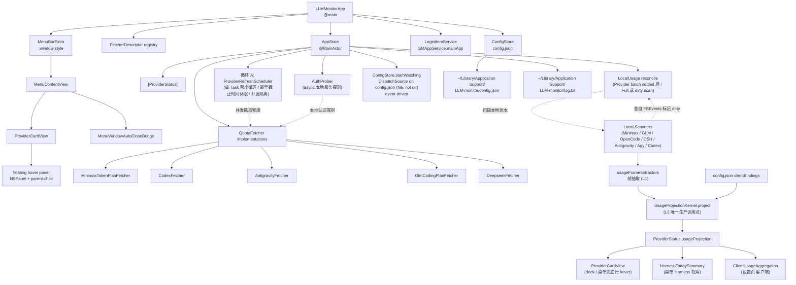

# LLM Monitor — Project Spec

macOS menu bar app for watching remaining LLM service quota. The app is intentionally passive: it lives in the menu bar, reads a local JSON config, refreshes quota in the background, and shows the latest status when the menu is opened.

## Current Scope

| Area | Current behavior |
|---|---|
| Platform | macOS 14+, SwiftUI `MenuBarExtra` |
| Build system | Swift Package Manager executable target (with `LLMMonitorTests` test target) |
| UI model | Menu bar drop-down plus a native Settings window; lightweight setup guidance appears when all providers are unconfigured |
| Edge dock | Optional screen-edge panel, one circle per enabled Provider, click-through by default and hidden while the frontmost App is fullscreen (`hideInFullscreen`, default `true`). Shape is a four-way `EdgeDockMode` picker (无 / 状态窗 / 小圆环 / 自动隐藏状态窗) whose default is **auto-hide window** — the feature ships on, occupying only a 7pt ring column until the mouse approaches |
| Hover details | Delayed floating hover panels for compact quota details |
| Login item | Settings-window launch-at-login toggle backed by `SMAppService.mainApp`; menu footer is read-only |
| Config | `~/Library/Application Support/LLM-monitor/config.json`, JSON, permission `0600` |
| Instance | One process per user config directory, enforced by `instance.lock` |
| Runtime log | `~/Library/Application Support/LLM-monitor/log.txt` plus stdout and `os.Logger` (privacy `.private`, Console.app 默认脱敏) |
| Quota Providers | `minimax_token_plan`, `codex_chatgpt`, `antigravity`, `glm_coding_plan`, `deepseek` |
| Clients | Codex, Antigravity, Agy, ZCode, OpenCode, DSH, MiniMax Code; clients may contribute to multiple quota providers |
| Refresh | Provider scheduler drives quota refreshes and settled-batch LocalUsage reconcile; scanners use FSEvents dirty invalidation |
| Config reload | Event-driven via a `DispatchSourceFileSystemObject` on the `config.json` **file** itself, not the directory (the directory also holds `log.txt` / `last-refresh.json`); debounced, with reopen-on-rename/atomic-replace retry and backoff (no polling) |
| Window lifetime | Menu closes on focus loss or after 30s of inactivity; any in-menu interaction resets the timer |

## Design Goals

1. **Low interruption** — the app never takes focus unless the user opens the menu.
2. **Local config with a native editor** — settings can edit supported provider fields, while `config.json` remains directly editable and reloads through filesystem events.
3. **Provider isolation** — each provider fetches independently; one slow or failing provider should not block the others.
4. **Auditable config** — API keys and provider settings live in a readable JSON file that can be diffed or managed by dotfiles.
5. **Graceful failure** — failed fetches show an error and keep the last successful quota in memory.
6. **Small provider surface** — adding a provider should mean implementing one `QuotaFetcher`, adding one `ProviderKind`, and registering one descriptor.

## Architecture Layers

代码按**逻辑分层**组织（单 SwiftPM target，无 module 边界——分层靠类型引用约束，不靠 import）。
目录划分（Models / Services / Views / Fetchers）与逻辑层**不一一对应**：Services 同时容纳 L0 数据源、
编排与基础设施；L1/L2 类型同住 `Models/UsageProjectionKernel.swift`。约束按逻辑层执行：

| 层 | 内容 | 允许依赖 |
|---|---|---|
| **L0 数据源** | `Fetchers/` 全部；`Services/` 下的各 `*Scanner` / `*DBReader` / `*Aggregation`（Antigravity/Agy/Codex/Dsh/GlmZcode/Minimax/Opencode 系，含 Antigravity scanner 按职责拆出的 `AntigravityFilesystem.swift` / `AntigravityLocalUsageCache.swift` 两个同类型 extension 文件） | L0 专属基础设施（`Services/Infra/`：HTTP、SQLite、进程、文件、并发原语、错误类型）；Models 的数据契约类型 |
| **L1 适配** | `HarnessUsageFrame` + 各 harness 的帧适配（`DshHarnessFrames` 等；类型与 L2 内核同住 `Models/UsageProjectionKernel.swift`） | L0 产物类型、L1 自身 |
| **L2 投影内核** | `UsageProjectionKernel.project`（`Models/UsageProjectionKernel.swift`）——全仓**唯一**生产调用点在 `ProviderStatus.usageProjection` | L1、`TokenAccounting`、`ModelPricingCatalog`、绑定矩阵 |
| **L3 消费** | 视图模型（`ClientUsageAggregation.swift` 的 `HarnessTodaySummary` / `ProviderStatusStrip`、`ProviderClientModel.swift` 的 `ClientUsageContribution` / `ProviderUsageProjection` / `ClientProviderUsageSummary`）与全部 `Views/` | L2 产出、AppState 状态宿主 |
| **横切** | 身份语汇 `Models/ClientIdentity.swift`（QuotaProviderID / ClientID / ClientDescriptor / ClientProviderBinding + 默认绑定矩阵）、纯数值 `Models/SaturatingArithmetic.swift`、排版常量 `Services/LayoutMetrics.swift` | 各层均可读；它们自身只依赖更底层 |

**方向规则**（2026-10 架构审核后确立）：禁止 Models → Services（业务编排/配置）、禁止 Services → Views（排版常量例外：统一走 `Services/LayoutMetrics.swift`）、禁止任何层 → L3。基础设施（`Services/Infra/`）是所有层的合法下层。审核基线：`Models → Services` / `Models → Views` / `Fetchers → Views` 代码引用均为零（注释与文档提及不计）；`Services → Views` 仅豁免 `EdgeDockController+` 族 **2 处 NSHostingView 宿主**（`+Window.swift:52` / `+Popover.swift:57`——AppKit 宿主装载 SwiftUI 根视图，归属待独立裁定）；`UsageProjectionKernel.project` 生产调用点唯一（`ProviderClientModel.swift:326`，其余全部在 `Tests/`）。

## Source Map

| Path | Responsibility |
|---|---|
| `Sources/LLM-monitor/LLMMonitorApp.swift` | App entry point, lifecycle delegate, `FetcherDescriptor` registry, fixed menu bar label |
| `Sources/LLM-monitor/Services/AppInstanceLock.swift` | Per-user single-instance lock held for the process lifetime |
| `Sources/LLM-monitor/Fetchers/FetcherDescriptor.swift` | `FetcherDescriptor` (provider 注册元信息 single source of truth) |
| `Sources/LLM-monitor/Models/ProviderClientModel.swift` | quota Provider / Client IDs、显式绑定、provider 中立 usage projection 与设置页摘要模型 |
| `Sources/LLM-monitor/Models/ClientIdentity.swift` | 身份语汇（QuotaProviderID / ClientID / ClientDescriptor / ClientProviderBinding）与默认绑定矩阵字面量（单一事实源） |
| `Sources/LLM-monitor/Models/UsageFrameExtractors.swift` | 帧抽取注册表 `usageFrameExtractors`（各 harness 的 ProviderStatus 字段 → `HarnessUsageFrame`，L1 适配） |
| `Sources/LLM-monitor/Models/UnifiedDailyTokenUsage.swift` | provider 中立日桶与当日 max 修补（`UnifiedDailyUsageNormalizer`） |
| `Sources/LLM-monitor/Models/MixedCurrencyEstimate.swift` | 跨 provider 金额汇总的统一折算类型（USD ×7 → CNY） |
| `Sources/LLM-monitor/Services/ClientUsageAggregation.swift` | L3 视图模型纯函数：设置页客户端拆行、菜单 `HarnessTodaySummary`、`ProviderStatusStrip` 投影、`HarnessSummaryCache` |
| `Sources/LLM-monitor/Services/LayoutMetrics.swift` | Services 与 Views 共读的排版常量（图表宽 / 卡片列与内容层内边距） |
| `Sources/LLM-monitor/Models/ModelPricingCatalog.swift` | 计价引擎：加载 `Resources/ModelPricing.json`（首条命中 / exact / matchAll / zhipu 兜底 / 下划线归一化）并应用 DeepSeek 高峰倍率 |
| `Sources/LLM-monitor/Resources/ModelPricing.json` | 价格数据：随 app 打包的唯一价格源（`ModelPricingJSONTests` 守门 schema 完整性） |
| `Sources/LLM-monitor/Models/ProviderStatus.swift` | UI-facing provider state + `ProviderKind` / `AccentColor` 枚举 |
| `Sources/LLM-monitor/Models/QuotaInfo.swift` | Provider-neutral quota 和 reset-credit 模型 |
| `Sources/LLM-monitor/Models/QuotaWindowStatus.swift` | Provider 无关的额度窗口存在性（`.present` / `.absent`）；fetcher 在边界归一化 raw 状态码 |
| `Sources/LLM-monitor/Models/AntigravityModelKind.swift` | Antigravity 模型族分类 enum（`gemini_models` / `claude_and_gpt_models` wire 值的 single source of truth） |
| `Sources/LLM-monitor/Models/AppMetadata.swift` | 版本 / build 号（读 Info.plist，设置页「关于」展示） |
| `Sources/LLM-monitor/Models/AnyJSON.swift` | 弱类型 JSON（Antigravity 递归解析用） |
| `Sources/LLM-monitor/Models/LocalUsageDaily.swift` | Antigravity / Agy / Codex / Minimax / GLM / DSH / OpenCode 共享的 7-day chart 协议 + 默认实现 |
| `Sources/LLM-monitor/Models/LocalDailyTokenUsage.swift` | 六个本地数据源共享的单日 token 聚合结构（统一收口原 `XxxDailyUsage`，on-disk JSON 键兼容） |
| `Sources/LLM-monitor/Models/LocalTokenUsageSample.swift` | Provider 中立的单次模型调用 sample（cache-inclusive input 口径 + `TokenUsageBuckets` 规范化入口） |
| `Sources/LLM-monitor/Models/TokenAccounting.swift` | harness raw input / output 计数口径的元数据枚举（cacheInclusive / uncachedOnly 等） |
| `Sources/LLM-monitor/Models/ReasoningCharSplit.swift` | 「思考字符数 → 思考 token 数」的守恒拆分纯函数（`reasoning + output == 账面 output` 恒成立）；5 处调用方：GLM/ZCode（`GlmZcodeDBReader`）、MiniMax Code（`MinimaxLocalUsageAggregation`）、Dsh M3（`DshLocalUsageScanner`）、OpenCode（`OpencodeDBReader`）、Agy（`AgyLocalUsageAggregation`） |
| `Sources/LLM-monitor/Models/LocalUsageRetentionWindow.swift` | 本地用量「落盘前保留窗口」的唯一口径（`LocalUsageRetentionWindow`，Antigravity / Agy / DSH / GLM-ZCode / Minimax / OpenCode 六个 scanner 共享）；刻意区别于展示层 7 天窗口，契约由 `ScannerRetentionContractTests` 锁定 |
| `Sources/LLM-monitor/Models/LocalUsageFreshness.swift` | 本地用量数据新鲜度（clean / dirty / scanning / failed），刻意独立于额度健康度 |
| `Sources/LLM-monitor/Models/DisplayOrder.swift` | Stable-ID ordering helper for configurable Provider cards and alphabetical fallback lists |
| `Sources/LLM-monitor/Models/OpencodeLocalUsage.swift` | OpenCode provider 分片、今日 / 7 天聚合与逐次 samples |
| `Sources/LLM-monitor/Models/UsageProjectionKernel.swift` | Provider × Harness 投影内核：`HarnessUsageFrame` 适配（clientID/sourceKey/quota 归属）→ `UsageProjectionKernel.project` 出 per-client × per-provider 投影（daily + per-model 桶 + 名义价值）；promptID 命名空间规则表（`UsageSampleNamespace`）与 DSH 帧适配（`DshHarnessFrames`）在此，旧 `DshUsageMerger` / `OpencodeUsageMerger` 已吸收删除 |
| `Sources/LLM-monitor/Models/GlmLocalUsage.swift` | GLM ZCode 本地 token 用量聚合模型（单源、原生 reasoning / turn_id、闲时窗口挂载、非智谱 provider 分片挂载） |
| `Sources/LLM-monitor/Models/ZcodeProviderSlice.swift` | ZCode 非智谱 provider 分片枚举（`minimax` / `deepseek` 前缀谓词、quota 卡映射与样本 promptID 命名空间） |
| `Sources/LLM-monitor/Models/DshLocalUsage.swift` | DeepSeek Harness session token 数据模型与 provider 分片 |
| `Sources/LLM-monitor/Services/DshLocalUsageScanner.swift` | 读取 `~/.dsh/sessions` 的 JSONL/zstd session 日志，按 provider 聚合 7 天用量 |
| `Sources/LLM-monitor/Models/AgyLocalUsage.swift` | agy CLI 本地 transcript token 用量快照模型（`isPartial` 出相等 / `isTruncated` 入相等的设计注释） |
| `Sources/LLM-monitor/Services/AgyLocalUsageScanner.swift` | 读取 `~/.gemini/antigravity-cli/brain/` 的 transcript JSONL + cli log 模型名时间线，聚合 7 天用量（预算截断 / 指纹缓存） |
| `Tests/LLMMonitorTests/AgyLocalUsageScannerTests.swift` | agy scanner 回归护栏（MODEL 行解析 / 去重 / 模型名 join / 缓存短路 / 预算截断 / 帧投影命名空间） |
| `Sources/LLM-monitor/Models/ProviderLocalUsage.swift` | Antigravity / minimax 共享的本地用量数据模型（保留历史类型别名） |
| `Sources/LLM-monitor/Fetchers/QuotaFetcher.swift` | `QuotaFetcher` protocol + 默认实现 |
| `Sources/LLM-monitor/Services/Infra/QuotaError.swift` | 统一错误类型 |
| `Sources/LLM-monitor/Fetchers/MinimaxTokenPlanFetcher.swift` | minimax Token Plan API 抓取 |
| `Sources/LLM-monitor/Fetchers/CodexFetcher.swift` | ChatGPT Plan API 抓取 + 本地 JSONL 解析 |
| `Sources/LLM-monitor/Fetchers/AntigravityFetcher.swift` | Antigravity 进程发现 + 本地 RPC + protobuf-like 解析 |
| `Sources/LLM-monitor/Fetchers/AntigravityProcessDiscovery.swift` | Antigravity 后端进程发现（IDE `language_server` / `agy` CLI 双形态、端口与 CSRF token 提取） |
| `Sources/LLM-monitor/Fetchers/AntigravitySchemas.swift` | Antigravity RPC request / response 的 Encodable 编码 schema 与解码模型 |
| `Sources/LLM-monitor/Fetchers/GlmCodingPlanFetcher.swift` | GLM Coding Plan 额度与 reset time 抓取 |
| `Sources/LLM-monitor/Fetchers/DeepseekFetcher.swift` | DeepSeek 账户余额抓取（`/user/balance`）+ 解析 |
| `Sources/LLM-monitor/Models/PeakWindow.swift` | GLM / DeepSeek 共用的参数化高峰窗口判定（`slots` × `weekdaysOnly`；GLM 本机时区单窗口可配置，DeepSeek 北京时间双窗口固定、高峰永不含周末） |
| `Sources/LLM-monitor/Services/AppState.swift` | 全局状态派生、config reload 接线（`configStore.startWatching()`，watcher 本体在 ConfigStore）、scanner wire-up、Provider batch/LocalUsage reconcile 与睡眠健康边界接线 |
| `Sources/LLM-monitor/Services/QuotaUpdateNotifier.swift` | 额度通知引擎：`QuotaEventDetector`（四类窗口事件边沿判定）+ `QuotaEventBatch`（按模型×渠道合并）+ 系统通知渠道 + `CompositeQuotaUpdateNotifier` 渠道扇出 |
| `Sources/LLM-monitor/Services/BarkNotifier.swift` | Bark 推送渠道：POST JSON 传输、稳定覆盖 id、锁屏/亮屏跳过判定、有界串行发送队列（冷却 / 重试 / 可取消） |
| `Sources/LLM-monitor/Services/TriggerStateStore.swift` | 通知触发器基线持久化（`notification-state.json`），检测 previous 的跨重启单一来源 |
| `Sources/LLM-monitor/Services/LastRefreshStore.swift` | `last-refresh.json` 的 actor 化持久化（合并窗口 + encode/fsync 移出 MainActor） |
| `Sources/LLM-monitor/Services/AppLog.swift` | stdout / 文件 (5MB rotate) / os.Logger (`.private`) 三路日志 |
| `Sources/LLM-monitor/Services/ConfigStore.swift` | config.json 读写 + 内容指纹跟踪 + 模板生成 + **单文件 `DispatchSource` watcher**（`startWatching()` / `startConfigWatcher()`，debounce + 原子替换后重开 fd + 退避重试，由 `AppState.start()` 调用） |
| `Sources/LLM-monitor/Services/LoginItemService.swift` | `SMAppService.mainApp` 包装 + 状态显示 |
| `Sources/LLM-monitor/Services/Formatters.swift` | token / percent / 时间 / codex window 标签格式化 |
| `Sources/LLM-monitor/Services/Infra/HTTPClient.swift` | 共享 HTTP 客户端（minimax / codex 三个 fetch 路径）；`ResponseByteLimits` 响应体硬上限（标准额度 8 MiB / Antigravity trajectory 64 MiB）由 `CappedDownloader.data` 在**响应体返回后**校验——超限抛 `responseTooLarge`，该错误为非瞬时（不重试、不进通知冷却）。async `session.data(for:delegate:)` 不向 per-task delegate 投递 `didReceive response` / `didReceive data` 内容回调（macOS 27 实测：URLProtocol 桩与真实网络均不触发），因此 `CappedDownloadDelegate` 的流式计数在当前调用方式下**不执行**，真正的拦截点是后置字节校验；delegate 保留待将来改用回调系任务。峰值内存仍由 URLSession 缓冲决定——该上限保证超限响应不进入调用方解析链路，不保证单次响应不被完整缓冲 |
| `Sources/LLM-monitor/Services/LocalUsageCoordinator.swift` | scanner 协议 + Combine wire-up 容器 |
| `Sources/LLM-monitor/Services/ProviderRefreshScheduler.swift` | 循环 A（额度循环）：单一 Task 管理所有 Provider 的 quota 定时排期，睡眠至最早截止时间，并发刷新 + 条目级隔离 |
| `Sources/LLM-monitor/Services/ManualRefreshGate.swift` | 手动 full refresh 与 in-flight background refresh 的合并协议（pending 登记 / 取消撤销 / 一次性补跑） |
| `Sources/LLM-monitor/Services/LocalUsageOrchestration.swift` | LocalUsage reconcile：按触发原因分层为 `.dirty` / `.full`（cache-assisted） / `.hardFull`（绕过各 provider 自己的 fingerprint / offset / cache），请求按 `dirty < full < hardFull` 优先级折叠成一次；`.hardFull` 只在启动首拍、日历签名失效与 `bypassesProviderCache` 时触发。Provider batch settled 后每拍都投递一次 reconcile（scanner 内部指纹短路决定是否真扫），不持有 Timer |
| `Sources/LLM-monitor/Services/LocalFSEventsWatcher.swift` | 可复用的单 scanner FSEvents 封装；每个 scanner 自己持有 watcher 与源路径，不维护全局路径表 |
| `Sources/LLM-monitor/Services/LocalVnodeWriteWatcher.swift` | 文件级 write/extend vnode watcher（持续增长的日志文件 dirty 标记；只报 dirty，扫描仍归 provider 循环） |
| `Sources/LLM-monitor/Services/AuthProber.swift` | 异步探测本地服务（antigravity）是否还活着 + 缓存 + 离/在线变化回调 |
| `Sources/LLM-monitor/Fetchers/RefreshResultMergers.swift` | `CodexFillingMissingMerger` 等 per-provider 合并策略（Minimax 使用默认 `IdentityRefreshResultMerger`） |
| `Sources/LLM-monitor/Services/Infra/DateParser.swift` | ISO8601 / unix timestamp 统一解析 |
| `Sources/LLM-monitor/Services/Infra/StringUtilities.swift` | 字符串小工具（trim / firstTrimmed） |
| `Sources/LLM-monitor/Services/Infra/ProcessRunner.swift` | 同步短命令子进程执行器（pgrep / lsof / pmset / zstd / node；持续排空 pipe + 超时与取消检查） |
| `Sources/LLM-monitor/Models/SaturatingArithmetic.swift` | 非负计数饱和算术（负值归零、溢出封顶 `Int.max`），聚合入口防损坏输入 |
| `Sources/LLM-monitor/Services/LocalUsageDayKey.swift` | `yyyy-MM-dd` day key（跟 SQLite `strftime` 对齐） |
| `Sources/LLM-monitor/Services/LocalUsageCalendarSignature.swift` | 决定本地日桶的日历输入签名（`LocalUsageCalendarSignature.make(calendar)`），随 provider 缓存落盘；冷启动时源文件没变也不会把按旧时区分组的快照当成当前数据 |
| `Sources/LLM-monitor/Services/TokenMonitorPaths.swift` | 全部本地用量 scanner 的共享落盘位置（`~/Library/Application Support/LLM-monitor/token-monitor/<provider>.json`）+ Antigravity 旧缓存目录 `legacyAntigravityCacheDir` |
| `Sources/LLM-monitor/Services/Infra/SQLiteConnection.swift` | SQLite3 通用连接层（三层读策略：无 -shm 且无 dirty WAL 时 immutable=1 直读；活跃时共享内存只读；异常由 SQLiteTempCopy 走 /tmp 副本 recovery） |
| `Sources/LLM-monitor/Services/Infra/SQLiteTempCopy.swift` | `/tmp` 副本 fallback：回退白名单 CANTOPEN / BUSY / READONLY 家族 / IOERR 家族 / CORRUPT，以及 immutable 直读打开后复检发现 `-shm`/`-wal` 出现的 `lostImmutableRace`（直读前提失效，非扫描失败）。副本读取同样 CORRUPT 时按源指纹（db/-wal/-shm 的 mtime+size，进程内不落盘）记忆为持久损坏，后续轮次跳过全量拷贝快速失败，指纹变化即失效恢复重拷——并发 checkpoint 撕裂页的重拷自愈路径不受影响。拷贝循环逐文件校验源指纹：db 拷完立即复验，失效即放弃本轮 wal/shm 拷贝，最多 3 轮后抛 `sourceChangedDuringSnapshot` |
| `Sources/LLM-monitor/Views/Color+Theme.swift` | 品牌色常量 |
| `Sources/LLM-monitor/Services/MenuBarRightClickHandler.swift` | 状态栏按钮右键菜单（best-effort） |
| `Sources/LLM-monitor/Services/StatusBarQuotaMetrics.swift` | 状态栏额度指标结构（`QuotaRingMetrics` / `StatusBarQuotaMetrics`），由 Icon Duo 仪表盘消费；原 App 图标 SVG 生成器已随「App 图标」改用固定设计稿而删除 |
| `Sources/LLM-monitor/Services/IconDuoSVGBuilder.swift` | Icon Duo 状态栏额度仪表盘的参数化 SVG 生成（左右额度弧 / 中心扇形 / 底部模型健康点 / 顶部节能点） |
| `Sources/LLM-monitor/Services/MinimaxDBReader.swift` | 读 minimax v2 `local_runtime_token_usage` 表 |
| `Sources/LLM-monitor/Services/MinimaxLocalUsageScanner.swift` | minimax v2 `runtime-state.sqlite` 单源 scanner（AsyncMutex + lastCommittedGeneration 串行化）|
| `Sources/LLM-monitor/Services/MinimaxLocalUsageAggregation.swift` | minimax reasoning 字符分摊比例回写 sample 与 per-day 聚合纯函数 |
| `Sources/LLM-monitor/Services/AgyLocalUsageAggregation.swift` | agy transcript MODEL 行解析、跨文件去重、thinking 字符守恒分摊与日聚合纯函数 |
| `Sources/LLM-monitor/Services/GlmZcodeDBReader.swift` | ZCode `model_usage` 表 SQL 读取 + Method A reasoning 归类 + per-day 聚合与 samples + 非智谱 provider 分片聚合（`ZcodeProviderSliceAggregate`） |
| `Sources/LLM-monitor/Services/GlmZcodeOffPeakReader.swift` | `~/.zcode/v2/tasks-index.sqlite` 闲时任务时间窗口读取（额度窗口排除依据） |
| `Sources/LLM-monitor/Services/GlmZcodeBalanceLogReader.swift` | ZCode 余额轮询日志解析（活动套餐 balances，`parseZcodeBalanceLog` 开关） |
| `Sources/LLM-monitor/Services/GlmZcodeLocalUsageScanner.swift` | GLM ZCode `db.sqlite` 单源 scanner（AsyncMutex + lastCommittedGeneration 串行化） |
| `Sources/LLM-monitor/Services/AntigravityLocalUsageScanner.swift` | Antigravity 纯 RPC 架构 scanner（AsyncMutex + lastCommittedGeneration 串行化，不用 SQLite .db 读表）|
| `Sources/LLM-monitor/Services/AntigravityFilesystem.swift` | `AntigravityLocalUsageScanner` 的文件系统侧 extension：conversations roots 枚举、`.db` / `.pb` 双格式识别与指纹、`isComplete` 语义（权限 / TCC / 瞬时 I/O 不得据此删缓存） |
| `Sources/LLM-monitor/Services/AntigravityLocalUsageCache.swift` | `AntigravityLocalUsageScanner` 的缓存与 index 类型 extension（与上面的 scanner 同类型，按职责拆文件） |
| `Sources/LLM-monitor/Services/AntigravityLocalUsageAggregation.swift` | Antigravity per-day turns / rounds 聚合与 sample 组装（纯函数，unit-testable） |
| `Sources/LLM-monitor/Services/AntigravityStepTimestampReader.swift` | Antigravity SQLite step 的 protobuf Timestamp 读取（RPC 事件缺 `createdAt` 时的回退） |
| `Sources/LLM-monitor/Services/OpencodeDBReader.swift` | 读取 OpenCode `message` 表并按 provider / day 聚合 |
| `Sources/LLM-monitor/Services/OpencodeUsageScanner.swift` | OpenCode DB 指纹、缓存、7 天窗口与 provider slice snapshot |
| `Sources/LLM-monitor/Services/Infra/AsyncMutex.swift` | actor-based async-aware mutex（scanner pipeline 互斥；支持 caller cancellation propagation — acquire 前 / 排队中 / acquire 后执行前三阶段均检查取消）|
| `Sources/LLM-monitor/Services/CancellationFilter.swift` | 统一"取消错误"判断（`Task.isCancelled` / `CancellationError` / `URLError.cancelled`），AppState 与 LocalUsageScanRunner 的两个 catch 入口共用 |
| `Sources/LLM-monitor/Services/Infra/FileManagerBox.swift` | `FileManager` 的 `@unchecked Sendable` 包装 + `fileManager` 字段 `private`（同文件 extension 之外不能直接拿到底层 `FileManager`）。`Tests/LLMMonitorTests/ConfigStoreTests.swift` 验证该访问约束 |
| `Sources/LLM-monitor/Services/Infra/HTTPTimeouts.swift` | HTTP timeout 集中地（国内 domestic 10s / 海外 overseas 15s / antigravity 本机回环），改一处全局生效 |
| `Sources/LLM-monitor/Services/LocalUsageScanRunner.swift` | 本地用量 scanner 共享的 lifecycle helper（generation 守门 / cancellation filter / defer generation 守门），消除镜像 boilerplate |
| `Sources/LLM-monitor/Services/SingleDBSnapshotScanner.swift` | 单库全量快照 scanner 基座（db + WAL 双维指纹与缓存 index；GLM / OpenCode scanner 复用） |
| `Sources/LLM-monitor/Services/DailyUsageAggregation.swift` | minimax / antigravity 共享的 per-day 聚合（补零填充 + 跨 source 合并） |
| `Sources/LLM-monitor/Services/ScannerIndexIO.swift` | minimax / antigravity 共享的 versioned `index.json` 读写（版本迁移 / 不匹配 reset） |
| `Sources/LLM-monitor/Services/ScannerFileError.swift` | scanner 共用的「明确不存在」错误判断（权限 / TCC / 瞬时 I/O 不误判为删除，保护 last-good cache） |
| `Sources/LLM-monitor/Services/LocalUsageScannerBase.swift` | 本地用量 scanner 的状态、generation、取消与 in-flight 去重基座 |
| `Sources/LLM-monitor/Services/LocalUsageSourceLifecycle.swift` | 本地用量源的 FSEvents/vnode 生命周期与 dirty 事件桥接 |
| `Sources/LLM-monitor/Services/CodexLocalUsageScanner.swift` | Codex session JSONL 本地用量缓存与窗口汇总 |
| `Sources/LLM-monitor/Models/SleepHealthModels.swift` | 「节能」模块 UI 与服务实现之间的稳定数据契约（断言快照 / 电源参数 / 健康度结果） |
| `Sources/LLM-monitor/Services/SleepHealthService.swift` | 睡眠健康度快照、防休眠断言与周期健康边界刷新 |
| `Sources/LLM-monitor/Services/SleepHealthEvaluator.swift` | 睡眠锁与系统电源参数的健康度评估 |
| `Sources/LLM-monitor/Views/MenuBarLabel.swift` | 菜单栏 label 视图（可见输入签名去重重绘 + 分钟时钟监听，App 图标 / Icon Duo / SF Symbol 多样式） |
| `Sources/LLM-monitor/Views/MenuContentView.swift` | 主面板（header / content / footer）+ `MenuDisplayClock` 驱动 + 高度桥 `MenuPanelHeightBridge`（`contentMaxSize` = 屏幕可见高 × 0.70）+ `MenuHairline` |
| `Sources/LLM-monitor/Views/HarnessUsageMenuView.swift` | 菜单的 Harness（客户端）视角：顶部一屏全局今日汇总（`HarnessUsageMenuView`）→ 按客户端分段（`HarnessSectionView`）→ 段内按模型一行（`HarnessModelRowView`）→ 底部 provider 兜底状态条（`ProviderStatusStripView`，hover 出完整卡片）。与 `ProviderCardView` 并列而非替代；模型行的 328pt 宽度预算（菜单 360pt / 内容 336pt）由 `HarnessUsageMenuViewTests` 钉住 |
| `Sources/LLM-monitor/Views/MenuTypography.swift` | 菜单面板与悬浮层统一排版常量（语义角色，禁止散落硬编码字号） |
| `Sources/LLM-monitor/Views/MenuWindowAutoCloseBridge.swift` | 失焦立即关 + 30s 无交互关闭（菜单内 mouse/scroll/key 重置计时）|
| `Sources/LLM-monitor/Views/ProviderCardView.swift` | provider 卡片 + `ProviderStateLabel` + `QuotaSummary`（卡内状态点已随菜单改版移除，状态由 `ProviderStateLabel` 胶囊承载） |
| `Sources/LLM-monitor/Views/QuotaViews.swift` | 各种 quota 行 + 进度条（`CombinedQuotaWindowRow` / `CombinedQuotaBar` / `SingleQuotaBar` / `ModelQuotaDockBlock` / `OffPeakUsageFootnote` / `DeepseekBalanceRow` / `ChatGPTPlanModelRow` / `CompactResetCreditsRow` / `QuotaBarTooltip`） |
| `Sources/LLM-monitor/Views/QuotaWindowUsageViews.swift` | 「额度窗口用量」区块族：模块标题 / 细分隔线、四桶绝对值与三个比率（`QuotaWindowUsageMetrics`）、时间构成条（`QuotaWindowTimeShareBar`）、原始值表格（`QuotaWindowUsageRawTable`）、reset credits 明细（`ResetCreditsDetailList`）与总段 `QuotaWindowUsageSection` |
| `Sources/LLM-monitor/Views/QuotaHoverViews.swift` | 仅剩 `UsageMetricHoverSummaryView`（额度用量指标 hover 摘要，input/cached 与 prompts/rounds 固定分行）；旧 `QuotaWindowsHoverView` 族已随 menuLayout 死分支整体删除 |
| `Sources/LLM-monitor/Views/HoverPanel.swift` | `HoverInfoRow` / `HoverPanelController` / 浮层管理 |
| `Sources/LLM-monitor/Models/EdgeDockEntry.swift` | `EdgeDockEntry` + `EdgeDockProjection`：已启用 Provider → 双环条目（外环=5h 有效额度 min(5h, 周×N) 与状态栏同口径、原始 5h 字段供 hover 文案对照、内环=原始周 各自最低 + 健康档位 + 品牌 kind），纯函数 |
| `Sources/LLM-monitor/Models/EdgeDockConfig.swift` | `DockEdge` / `EdgeDockConfig`：贴边方向 + 归一化位置（存比例不存绝对坐标），含手改值归一化 |
| `Sources/LLM-monitor/Services/EdgeDockGeometry.swift` | 边缘窗纯几何：行高/尺寸、贴边 frame、offset 往返换算、最近边吸附、行/圆矩形推算（兜底用）、popover 定位、沿边拖拽换算、贴屏侧直边的非对称标签形状 |
| `Sources/LLM-monitor/Services/EdgeDockDisplay.swift` | 屏幕稳定身份（`EdgeDockDisplay`，display UUID）：边缘窗跨屏只记 UUID，不记 `NSScreen` 对象 / 数组下标 / 几何位置 |
| `Sources/LLM-monitor/Services/FullscreenProbe.swift` | 当前 Space 全屏判定（`CGWindowList` 只读窗口边框 + 桌面装饰是否存在，fail-open，不需要辅助功能权限） |
| `Sources/LLM-monitor/Services/EdgeDockController.swift` | 边缘窗控制器本体：状态与配置（`applyRuntimeConfig` 是运行时改配置的唯一入口，`config` 的 setter 保持 private）+ 接线（`attach` / `teardown`） |
| `Sources/LLM-monitor/Services/EdgeDockController+Window.swift` | `NSPanel` 建/拆、按条目数与形态算窗口尺寸、贴到目标屏那一侧、"为什么没出现 / 出现在哪"的日志签名 |
| `Sources/LLM-monitor/Services/EdgeDockController+Mouse.swift` | 鼠标穿透与悬停接管：monitor 装卸、2Hz 轮询节拍、命中后的接管与释放、hover / 展开 / 收起的挂起任务 |
| `Sources/LLM-monitor/Services/EdgeDockController+Popover.swift` | Provider 卡片浮层（与 dock 两个独立窗口）：定位、显隐、鼠标停在浮层上时的接管保持 |
| `Sources/LLM-monitor/Services/EdgeDockController+Drag.swift` | 沿贴靠边滑动拖拽：阈值判定、跨屏换屏 UUID、落点吸附与位置持久化 |
| `Sources/LLM-monitor/Services/EdgeDockController+Fullscreen.swift` | 全屏门控：判定变化后重排窗口，以及窗口进出场动画期间的阶梯补测 |
| `Sources/LLM-monitor/Services/EdgeDockController+HitTesting.swift` | 边缘窗命中判定纯函数（`circleIndex` 圆命中 + `resolveRowRects` / `resolveCircleRects` 实测优先、几何兜底），`nonisolated static`，不读实例状态 |
| `Sources/LLM-monitor/Views/EdgeDockContentView.swift` | 边缘窗视图（外环=5h 有效额度、内环=周、中心=Provider 品牌图标，刘海式背景） |
| `Sources/LLM-monitor/Views/TokenChart.swift` | 7-day 柱图基础组件（`StackedTokenBar` / `TokenChartScale`） |
| `Sources/LLM-monitor/Views/TokenBucketBar.swift` | 水平三段占比条（input / cacheRead / billableOutput，reasoning 并入 output），输入为 `TokenAccounting` 归一化四桶；桶色与 7 天柱图一致 |
| `Sources/LLM-monitor/Views/AccountHoverViews.swift` | 账号信息值类型 + 行（`QuotaWindowAccountInfo` / `QuotaWindowAccountInfoRow`）：卡片第一段「Account Info」常驻行，取代已删除的折叠区与 `AccountHoverView` 浮层 |
| `Sources/LLM-monitor/Views/GlmPeakIndicatorView.swift` | GLM 高峰期提示行（倒计时 + 三档颜色） |
| `Sources/LLM-monitor/Views/GlmActivityPlanBalancesView.swift` | GLM 活动套餐余额展示行（`🎁 套餐名 94% (283M/300M) 08-31 09:00`，balances 空则不渲染） |
| `Sources/LLM-monitor/Views/DeepseekPeakIndicatorView.swift` | DeepSeek 高峰期提示行（北京时间倒计时，内嵌余额行右侧） |
| `Sources/LLM-monitor/Views/PeakIndicatorView.swift` | 高峰提示行公共组件（`TimelineView` 外壳 + `formatDuration`，GLM / DeepSeek 共用） |
| `Sources/LLM-monitor/Views/BrandLogoView.swift` | provider 品牌 logo 资源加载 + SF Symbol fallback |
| `Sources/LLM-monitor/Views/LocalUsageHoverViews.swift` | 7-day 泛型 chart + 泛型 footer |
| `Sources/LLM-monitor/Views/SegmentedQuotaProgressBar.swift` | 5h / 周额度分段条、窗口颜色与 reset 标记 + `EquivalentQuotaAllocation`（binding constraint 文案与 `bindingWindow` 判定） |
| `Sources/LLM-monitor/Views/SettingsEnergyPane.swift` | 设置页节能 pane：睡眠健康度、防休眠与电源参数矩阵 |
| `Sources/LLM-monitor/Views/SleepAssertionOffender+RowText.swift` | 「阻止休眠的第三方应用」行文案（`SleepAssertionOffender` 的行格式化 extension）+ 主面板 header 悬浮清单 `SleepOffendersHoverView`，两处共用同一份格式 |
| `Sources/LLM-monitor/Views/SettingsClientsPane.swift` | 设置页「客户端」tab：本地客户端用量诊断 + client ↔ quota 绑定开关（从 SettingsView 拆出） |
| `Sources/LLM-monitor/Views/ClientSegmentedControl.swift` | 设置页「客户端」切换条：原生 `NSSegmentedControl` 包装（段宽按文字测量写死，客户端变多时整体变宽并横向滚动，不压成省略号） |
| `Sources/LLM-monitor/Views/SettingsComponents.swift` | 设置窗口共享组件与统一字体角色（`SettingsTypography` / `SettingsSection` / `SettingsControlRow` / `SettingsPaneHeader`） |
| `Sources/LLM-monitor/Views/SettingsSaveTransaction.swift` | 设置保存事务：login item 更新 + config 保存的失败回滚语义 |
| `Sources/LLM-monitor/Views/SettingsView.swift` | 设置面板 |
| `scripts/build-app.sh` | Release arm64 `.app` bundle build（dSYM 导出 + strip）和 ad-hoc signing |
| `scripts/build-release.sh` | 发行编排入口：依次 build-app.sh → build-dmg.sh 并产出 SHA-256 校验和，签名 / notarization 变量透传 |
| `scripts/test-build-config.sh` | `build-app.sh` 构建期常量的 shell 冒烟测试（BUNDLE_ID 等「格式对但值被改」的回归护栏，自带框架） |
| `scripts/build-dmg.sh` | DMG packaging from the built `.app` |
| `scripts/test.sh` | 运行 `swift test`；仅显式设置 `INCREMENT_BUILD_NUMBER=1` 时递增 build 编号 |
| `scripts/audit.sh` | Shell syntax、Package、测试、Release 和 Swift 6 门禁 |
| `scripts/archive-source.sh` | 从 Git HEAD 生成源码归档 |
| `scripts/export-antigravity-quota.sh` | 导出 Antigravity 本地 quota 数据 |
| `scripts/generate-icns.sh` | 从源图生成 AppIcon.icns（由 sync-icon-assets.sh 调用，也可独立使用） |
| `scripts/sync-icon-assets.sh` | 图标资产唯一同步入口：IconPreview 副本 + 回退 icns 重生成 + sidecar 新鲜度记录；`--check` 供构建前置校验 |

## Architecture


```mermaid
flowchart TD
  App["LLMMonitorApp\n@main"] --> MenuBar["MenuBarExtra\n.window style"]
  App --> Descriptors["FetcherDescriptor registry"]
  App --> ConfigStore["ConfigStore\nconfig.json"]
  App --> LoginItem["LoginItemService\nSMAppService.mainApp"]
  App --> AppState["AppState\n@MainActor"]

  MenuBar --> MenuContentView["MenuContentView"]
  MenuContentView --> ProviderCardView["ProviderCardView"]
  MenuContentView --> AutoClose["MenuWindowAutoCloseBridge"]
  ProviderCardView --> HoverPanel["floating hover panel\nNSPanel + parent-child"]

  AppState --> Statuses["[ProviderStatus]"]
  AppState --> LoopA["循环 A: ProviderRefreshScheduler\n(单 Task 额度循环 / 最早截止时间休眠 / 并发隔离)"]
  AppState --> Reconcile["LocalUsage reconcile\n(Provider batch settled 后 / Full 或 dirty scan)"]
  AppState --> Prober["AuthProber\n(async 本地服务探测)"]
  AppState --> Watcher["ConfigStore.startWatching\nDispatchSource on config.json (file, not dir)\nevent-driven"]
  AppState --> Fetchers["QuotaFetcher implementations"]

  LoopA -. 并发抓取额度 .-> Fetchers
  Prober -. 本地认证探测 .-> Fetchers
  Reconcile -. 扫描本地账本 .-> Scanners["Local Scanners\n(Minimax / GLM / OpenCode / DSH / Antigravity / Agy / Codex)"]
  Scanners -. 各自 FSEvents 标记 dirty .-> Reconcile

  Fetchers --> Minimax["MinimaxTokenPlanFetcher"]
  Fetchers --> Codex["CodexFetcher"]
  Fetchers --> Antigravity["AntigravityFetcher"]
  Fetchers --> GLM["GlmCodingPlanFetcher"]
  Fetchers --> Deepseek["DeepseekFetcher"]

  Scanners --> Frames["usageFrameExtractors\n帧抽取 (L1)"]
  Frames --> Kernel["UsageProjectionKernel.project\n(L2 唯一生产调用点)"]
  ConfigBindings["config.json clientBindings"] --> Kernel
  Kernel --> Projection["ProviderStatus.usageProjection"]
  Projection --> ProviderCard["ProviderCardView\n(dock / 菜单兜底行 hover)"]
  Projection --> Harness["HarnessTodaySummary\n(菜单 Harness 视角)"]
  Projection --> ClientsPane["ClientUsageAggregation\n(设置页 客户端)"]

  ConfigStore --> ConfigFile["~/Library/Application Support/\nLLM-monitor/config.json"]
  AppState --> LogFile["~/Library/Application Support/\nLLM-monitor/log.txt"]
```

## Config Schema

The app reads and writes this shape:

```json
{
  "schemaVersion": 2,
  "refreshIntervalSeconds": 300,
  "providers": {
    "minimax_token_plan": {
      "enabled": false,
      "apiKey": "sk-cp-REPLACE-WITH-YOUR-KEY"
    },
    "codex_chatgpt": {
      "enabled": false,
      "authPath": "~/.codex/auth.json"
    },
    "antigravity": {
      "enabled": false
    },
    "glm_coding_plan": {
      "enabled": false,
      "apiKey": "REPLACE-WITH-YOUR-CODING-PLAN-KEY"
    },
    "deepseek": {
      "enabled": false,
      "apiKey": "sk-REPLACE-WITH-YOUR-KEY"
    }
  },
  "clientBindings": [
    {
      "clientID": "opencode",
      "quotaProviderID": "zhipu",
      "sourceProviderAliases": ["zhipuai-coding-plan"],
      "enabled": true
    }
  ]
}
```

首次启动模板默认关闭所有 provider，避免占位 Key 被误认为已配置。菜单中会显示“打开设置”引导；配置真实凭据后再启用对应 provider。上表是 `ConfigStore.writeTemplate` 实际生成的模板默认值（见 `ConfigStore.templateProviders()`）；两点需要说明：

- `clientBindings` 模板里写的是完整的 `ClientProviderBinding.defaultBindings` 默认绑定表（10 条：opencode → minimax / openai / antigravity / zhipu / deepseek，zcode → minimax / deepseek，dsh → deepseek / minimax / zhipu；其中 opencode → zhipu 与 zcode / dsh 全部默认 `enabled: true`，opencode 的其余四路默认关闭）。agy 不在绑定表里——它的帧自带 `quotaProviderID`，native 归 Google Antigravity 卡，不走 `clientBindings` 门控。上面只摘了一条示意。
- 模板**不写** `providerCardOrder`（nil 被 `encode(to:)` 省略），首屏按 Provider 显示名字母序；用户第一次在设置页调序后才出现该键。`statusBarIconStyle` / `statusBarHealthDotEnabled` / `statusBarHealthColors` / `bark` / `edgeDock` 同理，模板一律不写，缺省值见下表。

`refreshIntervalSeconds` 除了顶层全局默认，还可以在每个 provider 下**可选覆盖**。模板默认不写该字段，下面是一个让 Codex 每 60 秒刷新一次的自定义示例（并非模板默认值）：

```json
"codex_chatgpt": {
  "enabled": true,
  "authPath": "~/.codex/auth.json",
  "refreshIntervalSeconds": 60
}
```

| Field | Scope | Meaning |
|---|---|---|
| `schemaVersion` | global | Configuration schema version. Missing legacy values decode as version 0 and are normalized to the current version; unsupported future versions are rejected rather than silently defaulted. |
| `refreshIntervalSeconds` | global | Default refresh interval in seconds. Current default is `300`; effective values are clamped to 10 seconds...30 days. |
| `statusBarIconStyle` | global | Selected menu-bar icon theme. Missing or invalid values use `chartBar`. |
| `statusBarHealthDotEnabled` | global | Shows the 6 pt health dot on the menu-bar icon. Missing or invalid values default to `true`. |
| `statusBarHealthColors` | global | `healthyHex` / `warningHex` / `criticalHex` overrides for the health dot and Icon Duo arcs. Missing or malformed falls back to `StatusBarHealthColors.default` (`#34C759` / `#FFD60A` / `#FF453A`). |
| `edgeDock` | global | 屏幕边缘状态窗配置（`EdgeDockConfig`）。缺省等价于 `EdgeDockConfig.default`：`mode = .autoHideWindow`（默认开启、平时收起为小圆环）、`edge = .right`、`offset = 0.5`、`hideInFullscreen = true`、`compactSize = .small`、`independentRingColors = true`。`screenUUID` 为 nil 时跟随当前所在屏。**逐字段容错**：手改坏值只回退该字段，不整块报废（外层用 `try?` 解码，整块失败会连用户拖好的位置一起静默重置）。详见 `spec/ui-design.md`。 |
| `bark` | global | Bark 推送渠道（`BarkConfig`：`enabled` / `serverURL` / `deviceKey` / `sound` / `skipWhenAwakeAndUnlocked` / `ttl` / `group`）。字段缺失或 `enabled == false` 都表示不推送。详见 `spec/notifications.md`。 |
| `providerCardOrder` | global | Optional ordered list of stable canonical Quota Provider IDs (for example `deepseek` or `minimax`) for the main menu cards. Missing, empty, unknown, or duplicate IDs are normalized; omitted items are appended by Provider display name. |
| `providers.<id>.enabled` | provider | Disabled providers stay visible but are not fetched. Missing `enabled` decodes as `true`. |
| `providers.<id>.apiKey` | provider | API key for providers that do not manage external auth. Used by minimax. |
| `providers.<id>.displayName` | provider | Optional UI label override. |
| `providers.<id>.refreshIntervalSeconds` | provider | Optional provider-specific timer interval, with the same 10-second...30-day clamp. |
| `providers.<id>.authPath` | provider | External-auth path used by Codex. Accepts either an `auth.json` file path or its parent directory. |
| `providers.<id>.peakStartHour` / `peakEndHour` / `peakWeekdaysOnly` | provider | GLM Coding Plan 高峰窗口（24h 制本机时区半开区间 + 是否仅工作日）。缺省为 `14` / `18` / `true`；DeepSeek 的北京时间双窗口固定不可调，不读这三个字段。 |
| `providers.<id>.parseZcodeBalanceLog` | provider | 是否解析 ZCode 余额轮询日志、在 GLM 卡显示活动套餐余额。字段不存在 = 关闭（不读日志）。 |
| `providers.<id>.notifyIntervalRestored` / `notifyIntervalExhausted` / `notifyWeeklyRestored` / `notifyWeeklyExhausted` | provider | 四类额度事件各自的推送渠道（`QuotaNotifyChannel`：`none` / `system` / `barkAndSystem`）。字段不存在 = 默认渠道（恢复 → 系统通知，耗尽 → 不通知），与引入通知配置前的行为一致。 |
| `clientBindings[]` | client → quota Provider | Canonical source of truth for which Client usage slices contribute to a quota card. Schema v2; missing bindings are migrated from the legacy provider-level OpenCode switches by `AppConfig.legacyClientBindings(from:)`. |
| `providers.<id>.mergeOpencodeUsage` | legacy compatibility | Decoded for older config files and projected into runtime status for compatibility. The canonical source is `clientBindings[]`; Settings does not expose a per-provider OpenCode toggle and `applyAndSave` preserves this legacy field rather than rewriting it. Defaults are encoded in `ProviderConfig.shouldMergeOpencodeUsage(for:)` (GLM `true`, others `false`), and users with non-default needs edit `config.json`. |

`ProviderConfig.encode(to:)` omits nil optional fields, so saved config only includes relevant keys. `ConfigStore.applyAndSave()` writes pretty-printed, sorted-key JSON and reapplies `0600`.
Unknown or incorrectly typed `statusBarIconStyle` /
`statusBarHealthDotEnabled` values fall back
to their defaults; cosmetic config errors do not trigger recovery of the provider settings.

OpenCode and DSH are shared local Clients rather than menu-bar quota Providers. Their
raw multi-provider slices are surfaced in the new "客户端" tab instead of a dedicated
diagnostic pane; card display uses one provider-neutral aggregate token projection.
Antigravity is a special quota owner: its Gemini / Claude / GPT model usage remains
attached to the Antigravity quota scope.

Display ordering is intentionally scoped. Client tabs, Settings Provider tabs, and
Provider rows inside a Client tab are always sorted by their user-facing display name.
Only the main menu Provider cards are user-configurable through `providerCardOrder`;
the Settings window exposes up/down controls for this list. The ordering helper uses
stable IDs, ignores removed or duplicated entries, and appends newly registered
Providers using the default alphabetical order.

Settings > Clients uses horizontally scrollable client tabs sorted by display name
(Agy, Antigravity, Codex, DSH, MiniMax Code, OpenCode, ZCode). Each tab only renders quota
providers with observed local token activity. Provider rows are collapsed by default;
expanding one opens the shared seven-day token chart. It uses the same seven local
calendar days as the provider chart: the extra retained samples
for quota-window calculations must not add an eighth day or an out-of-window model
group to the client view. Group totals and price estimates use this same window.
The daily table keeps the columns `R/T → Input → Cache → Output → Reason → 价值`; the value column is shown
when the client scanner has per-call model samples. Below the chart, aggregate
tokens, the Input/Cache/Output/Reason breakdown, cache hit rate, and the seven-day
estimated public-API value remain visible. Values are displayed to two decimal
places. If a sample has no model name or no catalog entry, the client page shows
the unpriced model and its token amount instead of hiding the impact.
The estimate uses recognized model names and the published currency for that
provider; unknown models are explicitly marked as unpriced rather than assigned a
fallback price (zhipu/GLM is the one deliberate exception: its catalog always falls
back to GLM-5.3-Flash pricing). The OpenAI/Codex catalog recognizes GPT-5.5, GPT-5.6 Sol/Terra/Luna,
and GPT-6 Astra/Sol/Luna plus GPT-6.1 Sol by exact (lowercased) name match; legacy GPT-4, o1, o3, and generic
GPT-5 names remain unpriced. Antigravity's
independent GPT pricing rules are not affected. All price data lives in the bundled
`Sources/LLM-monitor/Resources/ModelPricing.json`, which `ModelPricingCatalog` loads
at startup (entries evaluated in array order, first hit wins; parse failures crash
loudly because the file is a developer-controlled, test-guarded resource). The
catalog records its update date in
`ModelPricingCatalog.lastUpdated` (currently `2026-10-01`, read from the JSON). Codex local events keep
the model from `turn_context` so GPT-5.6 / GPT-6 variants can be priced separately.

The main provider card footer also shows today's token total, cache hit rate, and
value when local model samples are available.

## Startup Flow

1. `LLMMonitorApp.init()` acquires the per-user `instance.lock`; a second instance exits without touching shared state.
2. `LLMMonitorApp.init()` creates `ConfigStore`.
3. `ConfigStore` creates the app support directory if needed.
4. If `config.json` is missing, `ConfigStore.writeTemplate(to:)` writes the built-in template.
5. `ConfigStore` loads JSON into `AppConfig`; if an existing file cannot be decoded, it is backed up as `config.json.corrupt-*.json` before recovery continues with `.default`.
6. `LLMMonitorApp.makeDescriptors()` registers the built-in providers.
7. `ConfigStore.ensureProvidersPresent(descriptors:)` adds missing provider blocks without overwriting existing blocks.
8. `LoginItemService` snapshots the current launch-at-login status from `SMAppService.mainApp`.
9. `AppState` derives `ProviderStatus` values from descriptors plus config.
10. `AppState.start()` registers each enabled provider with usable auth in `ProviderRefreshScheduler` — a single long-lived Task that wakes on the earliest due date and runs due refreshes concurrently (no per-provider timer).
11. `AppState.start()` calls `ConfigStore.startWatching()`, which opens the **`config.json` file itself** via `open(O_EVTONLY)` and installs a `DispatchSource.makeFileSystemObjectSource` listener (`eventMask` = `.write / .delete / .rename / .revoke`) — config edits trigger a debounced, event-driven reload in milliseconds (no polling). Directory-level watching is deliberately avoided: `log.txt` and `last-refresh.json` sit in the same directory and would fire a reload on every log line and every timestamp write. An editor's atomic replace (delete + rename) reopens the fd on the old inode's death, and a briefly-missing file is retried with backoff.

The lifecycle delegate calls `AppState.stop()` during normal application termination
and triggers an immediate `refreshAll()` after `NSWorkspace.didWakeNotification`,
so sleep/wake does not leave quota cards stale until the next configured timer tick.
Sleep health is refreshed at startup and wake, and the same deadline driver also schedules
a five-minute health boundary, so newly acquired sleep assertions or AC power changes
are reflected without opening Settings or restarting the app.

## Provider State Machine

```swift
enum State {
    case notConfigured(reason: String)
    case ready
    case loading(lastSuccess: QuotaInfo?)        // 抓取中,lastSuccess 兜底
    case ok(QuotaInfo)                          // 抓取成功
    case failed(message: String, lastSuccess: QuotaInfo?)
}
```

`State` 自身持有"上次成功数据" —— `.loading(lastSuccess:)` / `.failed(_, lastSuccess:)`
/ `.ok(info)` 三种 case 都能从 `state.lastSuccess` 拿到 QuotaInfo?。**没有**单独的
`_lastSuccess` 字段（之前有过，跟 `.failed.lastSuccess` 重复存，迁 `.ok → .loading →
.ok/.failed` 任意一处忘记更新就会让 UI 跟 `healthLevel` 不一致，已删）。

State derivation is descriptor-driven:

| Situation | State |
|---|---|
| Provider block missing from config | `.notConfigured("未在 config.json 中配置")` |
| `enabled == false` | `.notConfigured("已在 config.json 中禁用")` |
| API-key provider has empty/template key | `.notConfigured("API Key 未填写")` |
| External-auth provider has no local auth file | `.notConfigured("外部 auth 缺失：...")` |
| Antigravity local session missing | `.notConfigured("请先启动 Antigravity 并完成登录")` |
| Config and auth are present | `.ready` |
| Fetch in progress | `.loading(lastSuccess: prev)` |
| Fetch succeeds | `.ok(info)` |
| Fetch fails | `.failed(message, lastSuccess: prev)` |

`rebuildStatuses` 在 config 变更时被调用。如果 deriveState 返回 `.ready`（auth 还 ok），
旧 status 的 `.ok/.loading/.failed` 状态会**整体复用**（auth 没变就不擦数据）；
deriveState 返回 `.notConfigured` 时整个 state 重置，lastSuccess 跟着清。

`rebuildStatuses()` preserves the entire `State` (`.ok/.loading/.failed`) by provider id when auth is still valid (derived is `.ready`), so config reloads do not erase the last successful snapshot. When auth becomes invalid (derived is `.notConfigured`), state resets to `.notConfigured` and the QuotaInfo data is dropped.

## Refresh Behavior

所有 enabled provider 由单一 `ProviderRefreshScheduler` Task 统一调度（无 per-provider timer）：

1. 注册时立即调用 `refreshHandler(providerID, .full)` → AppState 的 `refreshProviderDirectly`
2. 每次唤醒取"最早到期时刻"，到期的 provider 用 TaskGroup 并发刷新（首轮 `.full`，后续轮询用 `.background` mode）
3. 成功后按 `providers.<id>.refreshIntervalSeconds ?? refreshIntervalSeconds` 计算下次到期
4. 失败按同一个 baseInterval 固定间隔随下一定时周期重试（不做指数退避：后台固定间隔刷新下，拉长重试间隔只会推迟恢复）
5. 任务被 cancel → 退出循环

**周期 full（reset credits 等“只在 full 抓取”的字段）**：`ProviderRefreshScheduler` 每累计
`periodicFullEveryN`（默认 20）次 `.background` 后，下一次补跑一次 `.full`（走常规 deadline，
不改变常规排期节奏）。这样 Codex 的 reset credits 不需要用户手动刷新也能周期性更新：默认 300s 间隔下
约每 `20×300s ≈ 100min` 自动 full 一次。`.background` 仍只抓主 quota，不抓 reset credits。

scheduler 集中持有排期与 in-flight 状态：`nextRefreshDates` / `midCycleDeadlines` / `inFlightModes` / `inFlightWaiters` 等。
in-flight dedup：`markInFlight(providerID)` 返回 false 时直接 `.deferred`（已被 timer /
manual / menu-open 任一路径占住）。手动 full refresh 若遇到 background 请求，会通过
`waitUntilNotInFlight` 等待；该等待支持 cancellation，取消时会移除带 UUID 的 waiter，
不会留下悬挂 continuation。多个 full refresh waiter 由 `pendingFullRefreshIDs` 做一次性
claim，当前 background 请求完成后最多补跑一次 full refresh。
成功与失败都直接按 baseInterval 写入 `nextRefreshDates`。
UI 通过 `earliestNextRefresh` 拿到所有 provider 中最早的下次触发时间，pub 到 `nextRefreshAt`。

`AppState.refreshProviderDirectly` 是 scheduler 的 refreshHandler 闭包：
1. 入口 `markInFlight` dedup，失败 `.deferred` 退出
2. fetch + 应用到 `statuses[idx]` + 通知 `statusDidChange` 广播
3. `defer { markNotInFlight }` 在 `await` 路径任何退出都执行
4. 失败时只记录 `.failed` 状态 + antigravity 走 `AuthProber.scheduleProbe` 重新探测（排期仍按 baseInterval）
5. config 变更时 generation mismatch 直接丢弃旧结果

The `effectiveRefreshInterval(for:)` helper clamps the interval to `10s...30d` to prevent
busy loops from typos (`0` or negative) and integer-conversion overflow from extreme values
in `config.json`.

Manual refresh paths:

| UI action | Method |
|---|---|
| Header refresh button | `AppState.refreshAll()` |
| Card context menu "立即刷新" | `AppState.refreshOne(providerID:)` |
| Menu open with any `.ready` provider | `MenuContentView.onAppear` triggers `refreshAll()` |
| Right-click menu bar icon | `MenuBarRightClickHandler.refreshClicked` |

`refreshAll()` starts one child task per refreshable provider. `ProviderRefreshScheduler.markInFlight`
deduplicates so timer + manual + menu-open fire on the same provider collapse to a
single in-flight request. Status mutations remain on the main actor; network waits are
asynchronous.

Config reload path:

1. `ConfigStore.startWatching()` opens the `config.json` **file** and installs a
   `DispatchSource.makeFileSystemObjectSource` listener; `AppState.start()` is its
   only caller.
2. Each event first schedules a 250 ms debounce, then reads the file on a detached
   utility task and calls `configStore.hasChangedSinceLastRead(using:)`; an
   unchanged fingerprint short-circuits without parsing.
3. If parsing succeeds, `ConfigStore` publishes the new config, AppState
   increments `configurationGeneration`, statuses rebuild, and all provider timers
   reschedule.
4. In-flight fetches captured the *previous* `configurationGeneration`; when they
   complete, the captured value is compared and stale results are dropped.
5. If parsing fails during reload, `ConfigStore` keeps the previous config.

## Per-Provider Result Merge

每个 fetcher 自带 `resultMerger: RefreshResultMerger` —— policy 跟 fetcher domain knowledge
放一起，AppState 不再写 `if kind == .minimaxTokenPlan { ... }` 之类的分支：

| Fetcher | Merger | Behavior |
|---|---|---|
| `MinimaxTokenPlanFetcher` | `IdentityRefreshResultMerger`（默认） | 直接用新值。历史上的 `MinimaxVideoPreservingMerger`（`.background` 模式沿用上次 video 条目）已删除 |
| `CodexFetcher` | `CodexFillingMissingMerger` | `resetCredits` / `codexUsageDetails` 缺失时回退到上次（避免 UI 空白）；reset credits 有独立新鲜度——`.background` 按设计跳过时保留原值与原时间，`.full` 抓取失败时保留旧值并标记「可能过期」，恢复成功清除 |
| `AntigravityFetcher` / `GlmCodingPlanFetcher` / `DeepseekFetcher` | `IdentityRefreshResultMerger`（默认） | 直接用新值 |

`CodexFetcher` 是当前**唯一**自带 merger 的 fetcher（`let resultMerger: RefreshResultMerger = CodexFillingMissingMerger()`）；其余走 `QuotaFetcher` 的默认实现。

AppState.fetch 成功后调 `fetcher.resultMerger.merge(new:previous:mode:)` 合成最终值。

## Auth Probing

Antigravity 是用本地 Antigravity / agy CLI 的 `language_server`，进程可能中途崩。
`AuthProber` 异步探测 `fetcher.checkLocalAuth()` 并缓存结果：

- `scheduleProbe(for: providerID)`：启动探测（fetcher.hasLocalAuth() false 时不发）
- `markAvailable(providerID)`：refresh 成功路径直接标记可用
- `isUnavailable(providerID)`：用于 `rebuildStatuses` 派生 `.notConfigured("请先启动 Antigravity...")`
- `reset()`：config 变更时清空 cache + 取消所有 in-flight
- `cancelAll()` / `cancel(providerID:)`：stop / schedule 同 provider 前的清理

`onChange` 回调在 cache 值变化时触发，AppState 收到 `false` 立刻 `rebuildStatuses + rescheduleAll`
让 UI 立即显示离线提示；`true` 不在 callback 里 rebuild（依赖下次 refresh 成功后的 markAvailable）。

## Scanner Concurrency (本地用量 scanner 的并发模型)

`MinimaxLocalUsageScanner` / `AntigravityLocalUsageScanner` 的缓存写入并发安全靠
**三层防御** 叠加：

1. **`inFlightTask` dedup**（`@MainActor` instance 状态）—— `scan()` 入口检查
   `inFlightTask == nil`，已有 in-flight 就直接 return. 正常路径下保证"同时间最多一个
   worker". cancel + rescan 是唯一会并发的场景.

2. **`AsyncMutex` pipeline 串行化**（actor-based async-aware mutex,
   `Services/Infra/AsyncMutex.swift`）—— 整个 `performScanPure` 包在
   `try await pipelineMutex.withLock { ... }` 里. 旧 worker 跑完整个 pipeline
   （包括 saveIndex）才让新 worker 开始, 杜绝 "两个 worker 并发 loadIndex/saveIndex
   导致 cache revert".

3. **`lastCommittedGeneration` 守门**（`@MainActor private var`, 每个 scanner
   实例独立; `performScanPure` 在 `AsyncMutex` 内部跨 `@MainActor` hop 调
   `await scanner.readLastCommittedGeneration()` 读 + `await scanner.writeLastCommittedGeneration(...)`
   写, 整个 read + write-to-disk + update 都在 mutex 内 atomic）—— 旧 worker
   即使晚到 mutex, 读到的也是新 worker 更新过的值, shouldSave=false 跳过
   saveIndex, 磁盘保留新 worker 的 view. **P1 fix**: 之前用 `lastCommittedAtStart`
   快照从 main actor 传入, 跟 mutex 内的 write 跨 await 拆分, 会有 "新 worker
   写盘后, 旧 worker 在 mutex 外读 stale 值, 进 mutex 后用 stale 值判断
   shouldSave=true, 写 A_view 回滚 B_view" 的回归. 修法: 把 read 移回
   mutex 内, 跨 @MainActor 边界 hop (`await scanner.read...`) 持锁执行.
   三层缺一不可:
   - 没 dedup: 正常路径就 race
   - 没 AsyncMutex: cancel+rescan 期间 race
   - 没 lastCommittedGeneration (在 mutex 内): 旧 worker 晚到 mutex 时回滚新 worker 的 cache

`runScan` 端还有 `startedGeneration == latestGeneration` 守门, 负责旧 worker 的
`in-memory result` 不写到 `self.lastResult`（保护 UI）. 三个守门各管一段, 不重叠.

GLM ZCode scanner 是有意的**全量快照模型**：它每次从同一个数据库重建完整 snapshot，
并由 `inFlightTask` + `AsyncMutex` + `runScan` generation 守门保护；它不使用
`lastCommittedGeneration`，因为没有 Minimax/Antigravity 那种按 source 增量合并后可能回滚
其他 source 的 cache view 的路径。这个差异是设计选择，不是遗漏的第三层。

**本地用量 scanner 共享的 lifecycle 抽到 `LocalUsageScanRunner`**（`Services/LocalUsageScanRunner.swift`）：
- `scan()` / `cancelInFlight()` / `runScan()` 的 boilerplate（启动 / 完成 generation
  检查、cancellation filter、applyResult / applyError 闭包注入）走 runner
- 各自 scanner 只实现"具体 work"（mutex + `performScanPureImpl`）跟"defer 块清
  isScanning / inFlightTask"
- 之前各 scanner 有约 80 行镜像 lifecycle 代码，现在各约 50 行
- `LocalUsageScanRunner.run` 是 enum 静态函数（不是 class），从 `await
  MainActor.run { latestGeneration() }` 拿 scanner 的 generation — 不引入
  新的 actor / state 污染各 scanner 独立的状态机
- **不**抽 base class / 不**改** `performScanPure` 签名 — 测试 surface
  （`testGate` / `performScanPure`）保留，避免大改测试

**Minimax / Antigravity 两个 provider 的 apply 路径抽到 `AppState.applyLocalUsage`**：
- `applyAntigravityLocalUsage` / `applyMinimaxLocalUsage` 99% 一样（`providerID` 查表 +
  no-op 检查 + `mutateStatus` 写入），原本是镜像重复。
- 抽到 `applyLocalUsage<T: Equatable>(kind:field:fieldName:summarize:usage:)`：
  - 用 `WritableKeyPath<ProviderStatus, T?>` 让 set 路径走类型系统，避免每次写闭包
  - `summarize` closure 让调用方按"X sessions" / "X events" 等不同口径打印日志摘要
    （避免 dump 完整 7-day daily 数组，污染 debug 日志）
  - 派生自 `ProviderKind.logTag`（新加的 short tag，跟 fetcher `logTag` 约定一致）

**`AntigravityLocalUsage` / `MinimaxLocalUsage` 自定义 `==` 排除 `scannedAt`**：
- 默认 Equatable 因 `scannedAt: Date?`（每次扫描都是新 `Date`）让"内容没变但 scannedAt 变了"
  的两份 usage 永远 !=，`AppState.apply*LocalUsage` 的 no-op 检查形同虚设：
  每次都打 `logInfo` + 触发 `@Published` willSet 无意义 UI reload（实测 5 天 1298 行 logInfo spam）。
- 修法：自定义 `==` 只比业务字段（`today` / `dailyTokenUsage` / `sessionCount` /
  `eventCount` / `failedSessionCount`），`scannedAt` 不参与 equality。
- Codable 自动合成的 `CodingKeys` 不受影响 —— `scannedAt` 仍然被编解码到 JSON cache。

**apply 路径的日志范式统一**：
- `applyAntigravityLocalUsage` / `applyMinimaxLocalUsage` 全部改 `logDebug`
  （与 `LocalUsageCoordinator.sink fire` 一致）；release build 不输出。
- refresh 路径的 `[antigravity/refresh] BEFORE/AFTER mutate` 也降级到 `logDebug`。
- 高频路径不再污染 release log.txt（5MB rotate 阈值下原版每天接近触顶）。

`AsyncMutex` 用 `actor` + waiters FIFO 队列实现 "锁跨 await 是设计内的": 持锁 worker
await 时 actor executor 释放, 但 waiters 队列仍持有锁; 下一个 worker 在 acquire() 处
await 挂起, 锁不释放. `withLock(work)` 闭包抛错时也保证 release. 锁不可重入；持锁的
work 不能嵌套调用同一个 `withLock`，否则会等待自身释放锁。

**Cancellation 语义**：`acquire()` 用 `withTaskCancellationHandler` +
`withCheckedThrowingContinuation`, 支持 caller cancellation propagation.
三阶段防护：(1) acquire 前 `try Task.checkCancellation()` 阻止已取消任务拿空闲锁；
(2) 排队等待期间 `cancelWaiter(id:)` 从队列移除并立即抛 `CancellationError`（不拿锁不执行 work）；
(3) `withLock` 在 acquire 成功后执行 work 前再次 `try Task.checkCancellation()`，
catch 块始终 `release()` 防止锁泄漏。

**Test gate**：`#if DEBUG` 包起来的 `static var testGate: (@Sendable () async -> Void)?`,
测试可以注入一个 `TestGate.wait()` 让 worker 在 SQL/RPC 前阻塞, 精确控制 cancel+rescan
时序. release build 的 binary 完全不带这个字段.

## UI Event Broadcasting

`AppState.statusDidChange: PassthroughSubject<Void, Never>` 是统一的广播通道。
所有"改 statuses 数组"或"改 status[idx] 局部字段"的入口（`mutateStatus` / `rebuildStatuses` /
`setScanningState` / `apply*LocalUsage`）都 fire 一次，MenuBarExtra 上挂一个
`.onReceive(state.statusDidChange) { _ in }` 即可绕开 MenuBarExtra 的 view 缓存。

`mutateStatus(at:_:)` 用 "copy array → modify → assign once" 模式：
赋值触发 `@Published` willSet 自动 send `objectWillChange`，加上手动 `statusDidChange.send()`
走显式 publisher 通道，两路保险。之前是 `objectWillChange.send() + in-place mutation` +
3 个独立 PassthroughSubject（`antigravityUsageDidChange` / `minimaxUsageDidChange`），已合并。

## Test Suite

- 规模：`Tests/LLMMonitorTests/` 按主题一文件组织（2026-10 重组后 ~120 文件 / ~1060 用例）。
- **串行执行是既定选择**：`swift test --parallel` 实测（2026-10-02，5 连跑 3 败）不可用——`SQLiteTempCopyTests` 的临时副本断言扫描跨进程共享目录，并行 worker 互相误判；且慢测试为睡眠型，并行的 wall 收益仅 ~4s。并行化前提：先给 SQLiteTempCopy 的副本目录引入进程级隔离，再复评。
- 慢用例的等待注入缝已建立：调度器（now/sleep）、Bark 退避（retryDelay）、vnode 合并窗口（coalescingWindow 参数）；新增耗时敏感测试时优先走注入缝，不要写死真实 sleep。

## Launch At Login

The Settings panel includes a launch-at-login toggle backed by `SMAppService.mainApp`. The menu footer displays read-only status text (`自启 ✓` / `自启 ✗`).

Behavior:

| Situation | UI text |
|---|---|
| Registered | `已开启开机自启动` |
| Not registered, app in `/Applications` | `可开启开机自启动` |
| Not registered, app outside `/Applications` | `建议放到 Applications 后再开启` |
| Registered but blocked by system approval | `需要在系统设置中批准登录项` |
| Service not found / unsupported runtime | `当前环境暂不支持开机自启动` |

Implementation notes:

- This works best from a packaged `.app`, especially when the bundle lives in `/Applications`.
- The toggle does not write to `config.json`; it talks directly to the system login-item service.
- Registration failures are shown in the Settings panel and written to `log.txt`.

## Data Model

`QuotaInfo` is provider-neutral:

| Field | Meaning |
|---|---|
| `models` | One or more `ModelQuota` rows shown in the card |
| `resetCredits` | Optional ChatGPT/Codex reset-credit details |
| `planLabel` | Optional plan label, currently parsed from Codex `id_token` |
| `accountEmail` | Optional logged-in account. Only Antigravity provides it; other providers leave it nil (the card's Account Info row visibility is decided solely by `QuotaWindowAccountInfo.make`) |
| `codexUsageDetails` | Optional local 5h / weekly token summary for Codex |
| `balanceDetail` | Optional structured DeepSeek balance breakdown (`DeepseekBalanceDetail`); replaced the preformatted string that used to be stuffed into `accountEmail`. Always nil for other providers |
| `fetchedAt` | Successful fetch timestamp |

`ModelQuota` carries two quota windows:

| Window | Fields |
|---|---|
| 5-hour / interval | `intervalTotalCount`, `intervalUsageCount`, `intervalRemainingPercent`, `intervalStatus`, `intervalResetsAt`, `intervalWindowSeconds` (optional; ChatGPT/Codex 等动态窗口) |
| Weekly | `weeklyTotalCount`, `weeklyUsageCount`, `weeklyRemainingPercent`, `weeklyStatus`, `weeklyResetsAt`, `weeklyWindowSeconds` |

`intervalStatus` and `weeklyStatus` use the shared `QuotaWindowStatus` type:
`.present` means that the provider exposed the window, including an exhausted `0%` window;
`.absent` means that the window is missing or unavailable. Provider-specific raw status codes
are normalized at each fetcher boundary and must not leak into shared UI or health logic.

The current UI emphasizes reset time and remaining percent. Token totals are preserved in the model but are often `0` for percent-only APIs. Codex additionally computes local token usage summaries from `~/.codex/sessions` and `~/.codex/archived_sessions`.

### OpenCode merge data

`OpencodeLocalUsage` stores one `OpencodeProviderUsage` per OpenCode `providerID`.
Each slice contains today's `OpencodeDailyUsage`, seven local calendar days, a
tokenized assistant-message `roundCount`, and recent samples. The four card switches
are applied at the view-state boundary:

- off: keep the native/local card source unchanged;
- on: add the matching OpenCode slice field by field;
- samples: prefix OpenCode prompt IDs before concatenation so native and OpenCode
  turns cannot collide;
- ChatGPT: convert OpenCode uncached input plus cache read into Codex's complete
  `inputTokens` / `cachedInputTokens` representation before addition.

OpenCode rounds count tokenized assistant messages. Turns count distinct
`COALESCE(parentID, message.id)` values per day. The scanner pads the seven-day window
and rebases it after midnight even when the database fingerprint has not changed.

## Health Algorithm

Health is computed from remaining percent:

```swift
if percent < 15 { .critical }
else if timeFraction == nil && percent < 30 { .warning } // 5h / short window
else if let timeFraction, percent < min(timeFraction * 100, 50) { .warning } // weekly
else { .healthy }
```

`ModelQuota.colorLevel` is the single source of truth for both health and progress-bar
colors. Short windows use a fixed 30% warning threshold; long windows use the smaller
of the remaining-time percentage and 50%. `ModelQuota.healthLevel` uses the worse of
the interval and weekly windows.
`QuotaInfo.healthLevel` uses the worse model.
`ProviderStatus.healthLevel` returns `HealthLevel?` (optional) and is derived from
`state.lastSuccess?.healthLevel` —— 跟 state 自带的 QuotaInfo? 同步，**不**会
跟 state 里的数据不一致。`stateHasSuccessData` helper 用来判断一个 state
是否带"上次成功数据"（`.ok/.loading/.failed` 都返回 true）。

| State | Health source |
|---|---|
| `.ok(info)` | `info.healthLevel` |
| `.loading(lastSuccess: prev)` | `prev?.healthLevel`（无则 nil） |
| `.failed(_, let last)` | `last?.healthLevel`（无则 nil） |
| `.ready` / `.notConfigured` | `nil`（UI 显示灰点，不归类为"健康"） |

`nil` 让 UI 端的状态胶囊用 secondary 灰色渲染，明确区分"没数据"和"有数据但健康"。菜单栏的 `iconDuo` 仪表盘会随额度指标与节能/睡眠健康度变化；`quotaLogo`（App 图标）是固定设计稿、不随健康度变化；标准 SF Symbol 样式则保留右下角状态点与刷新中的图标替换。卡片状态点和进度颜色同样反映健康度。

## Error And Fallback

On successful fetch:

- state becomes `.ok(info)` (info 自带 QuotaInfo = 之前的 _lastSuccess 角色)
- `lastRefreshedAt` becomes `info.fetchedAt`
- `lastRefreshAt` is set to `Date()`

On failed fetch:

- state becomes `.failed(message, lastSuccess: prev)` (prev 来自上一个 .ok 状态)
- the card shows the error in red
- if `lastSuccess` exists, the old quota is still displayed with reduced opacity

之前用单独的 `_lastSuccess` 字段跟 `.failed.lastSuccess` 重复存 —— 现在
`State` 自身持有 QuotaInfo，迁 `.ok → .loading → .ok/.failed` 不再需要双写。
- `lastRefreshAt` is still updated

Fetcher errors use `QuotaError`:

| Case | User-facing description |
|---|---|
| `missingAPIKey` | `未配置 API Key` |
| `invalidResponse` | `响应格式无效` |
| `httpError(status, body)` | `HTTP <status>: <first 200 chars>` |
| `decodingError(message)` | `解析失败：<message>` |
| `networkError(message)` | `网络错误：<message>` |

Antigravity-specific note:

- The fetcher does not trust stale OAuth tokens in `state.vscdb`.
- It reuses the local authenticated Antigravity `language_server`, discovers its HTTPS port and CSRF token, and reads quota through local RPC endpoints.

## Provider Registration Contract

Adding a provider currently requires:

1. Add a `ProviderKind` case in `Models/ProviderStatus.swift`.
2. Add an `AccentColor` case (if it has a brand color) in the same file.
3. Decide whether `kind.usesExternalAuth` is `true` or `false`.
4. Implement `QuotaFetcher` in `Sources/LLM-monitor/Fetchers/`.
5. Return provider-neutral `QuotaInfo` from `fetch()`.
6. Register a `FetcherDescriptor` (id / displayName / kind / icon / accentColor /
   makeFetcher / settingsTabTitle / settingsTabSubtitle) in
   `LLMMonitorApp.makeDescriptors()`.
7. 在 `SettingsView.providerPane(for:)` 派发里加一个 `case`，写该 provider 的
   设置 UI（默认走"enabled toggle + 独立刷新间隔"通用模板，特殊字段
   如 API Key / authPath 在这里加）。
8. Add or update provider spec under `spec/providers/`.

`ConfigStore.ensureProvidersPresent()` will add a placeholder config block for the new descriptor at the next app start.

**如果新 provider 有本地用量 scanner**（参考 `MinimaxLocalUsageScanner` /
`AntigravityLocalUsageScanner`），额外步骤：

9. 写一个 `XxxLocalUsage: Equatable, Codable, Sendable` 聚合 model（参考
   `MinimaxLocalUsage`），**自定义 `==` 排除 `scannedAt`**（每次扫描都是新 `Date`，
   默认 Equatable 让 no-op 检查形同虚设，触发无意义 UI reload + log spam）。
10. 写一个 `XxxLocalUsageScanner: ObservableObject, LocalUsageScanner<XxxLocalUsage>`
    实现（参考 `MinimaxLocalUsageScanner`），用 `AsyncMutex` + `lastCommittedGeneration`
    串行化 cache 写（防 cache revert）。`LocalUsageScanRunner.run` 抽走了
    lifecycle boilerplate，scanner 只实现 work + defer 块。
11. 在 `AppState` 加一个 `lazy var xxxLocalUsageCoordinator = LocalUsageCoordinator<XxxLocalUsage>(...)`
    （参考 `antigravityLocalUsageCoordinator`），apply 闭包走 `applyLocalUsage<T: Equatable>(kind:field:...)`
    通用函数（**不**要再写镜像的 `applyXxxLocalUsage`）。
12. 本地用量扫描由 `ProviderRefreshScheduler` 的 `onBatchSettled` 驱动：每批 Provider
    请求全部返回后（不论成功/失败）投递一次 `LocalUsageOrchestration` reconcile。
    **reconcile 每拍都跑**，不是只在 FSEvents 报 dirty 时才跑：常规档是 `.full`
    （cache-assisted），由各 scanner 自己的 fingerprint 决定复用缓存还是真扫；
    `.hardFull`（绕过 fingerprint / offset / cache）只在启动首拍、日历签名失效
    （`LocalUsageCalendarSignature`）和 `bypassesProviderCache` 时触发。请求按
    `dirty < full < hardFull` 折叠，FSEvents / vnode dirty 只是把该拍标成 `.dirty`
    的一个来源。即使 Provider 全部禁用，调度器也会完成一次空 pass，保证首次扫描
    仍能拿到 Provider 流程产出的窗口输入。新客户端需要在自己的 scanner 内注册
    watcher，并在 `LocalUsageOrchestration.checkClientReadiness` 登记数据源就绪判断。

**已落地案例**：`DeepSeek` 完整走上述 1–8 步（无本地用量 scanner，跳过 9–12），
且是唯一一个 **post-fetch 无副作用** 的 provider（`refreshProviderDirectly` 的
kind 派发链里没有 `.deepseek` 分支）。它的高峰窗口为北京时间周一至周五 9–12 / 14–18
（`DeepseekPeakWindow.defaultWindow`），时段固定不可调；高峰永不含周末，周六、周日
全天平价。详见 [`spec/providers/deepseek.md`](providers/deepseek.md)。

Lookup pattern in the rest of the code:

```swift
descriptors.first(where: { $0.kind == .newProvider })?.id
```

**Runtime single source of truth.** AppState and SettingsView both look up the id
through this path. Two known edges (intentional, not bugs):

1. `ConfigStore.writeTemplate` is a `static` function called before `descriptors`
   is available, so the bootstrap `config.json` template has hardcoded
   `providers.<id>` segments. The runtime `ensureProvidersPresent(descriptors:)`
   follows the descriptor path correctly.
2. `QuotaFetcher.providerID` is a stored property on the fetcher itself, used for
   log tags and self-identification. It is the same string as the descriptor id,
   but stored locally because the fetcher is a `Sendable` value that may be used
   independently of the registry.

**SettingsView 派生 tab**（不是硬编码）：`SettingsTab` 是 `.general` + `.provider(FetcherDescriptor)`
的 enum。`SettingsView.allTabs` 直接 `[.general] + descriptors.map { .provider($0) }`，
侧栏 icon / 标题 / 副标题从 descriptor 拿，**新增 provider 不用改 `SettingsTab` 枚举本身**。
`providerPane(for: ProviderKind)` 是 kind 派发，加新 provider 在那里加一个 `case` 写
pane UI（默认模板：enabled toggle + 独立刷新间隔；特殊字段如 API Key / authPath
在 case 里加）。`SettingsPaneHeader` 也走同一个 `SettingsTab`，不再 hardcoded icon / title。

## Runtime Files

| File | Purpose |
|---|---|
| `~/Library/Application Support/LLM-monitor/config.json` | User-editable config |
| `~/Library/Application Support/LLM-monitor/notification-state.json` | 通知触发器基线（每次成功刷新回写，供边沿检测跨重启连续） |
| `~/Library/Application Support/LLM-monitor/log.txt` | Rotated runtime log (5 MB 上限 rotate, 保留 active + .1 + .2 共 3 份) |

The footer has buttons to open the config file and reveal the log file in Finder.

## Build And Packaging

Development run:

```bash
swift build
./.build/debug/LLM-monitor
```

Build an app bundle:

```bash
./scripts/build-app.sh [version] [build-number]
```

Package a DMG after building the app:

```bash
./scripts/build-dmg.sh
```

需要 notarization 时，先用 `xcrun notarytool store-credentials` 保存凭据，再显式启用：

```bash
CODESIGN_IDENTITY="Developer ID Application: ..." \
NOTARIZE=1 NOTARY_PROFILE="llm-monitor" ./scripts/build-dmg.sh
```

脚本会签名 DMG，等待 Apple 审核结果、staple ticket 并执行 `stapler validate`；普通本地构建默认不签名 DMG，也不访问 notarization 服务。

`build-app.sh` compiles an arm64-only release binary (`swift build -c release --arch arm64`,
preferring the triple-specific product path so stale universal artifacts under
`.build/apple/Products` are never picked up), creates `build/LLM-monitor.app`, writes
`Info.plist`, sets `LSUIElement=true`, and ad-hoc signs the app.

### App icon packaging（双路线设计，已裁定勿再翻转）

`build-app.sh` 按固定优先级选择图标路线（`scripts/build-app.sh` 的 `[3/4]` 之前步骤）：

1. **Icon Composer 路线（主路线）**：仓库存在 `images/LLMMenu.icon` 工程源时，用
   `xcrun actool` 编译出 `Assets.car` + `LLMMenu.icns` 放入 `Contents/Resources/`，
   `Info.plist` 写 `CFBundleIconFile=LLMMenu` 与 `CFBundleIconName=LLMMenu`。
2. **静态回退路线**：没有 `.icon` 目录时，复制 `Sources/LLM-monitor/Resources/AppIcon.icns`，
   `CFBundleIconFile=AppIcon`。

**职责划分（这是设计意图，不是缺陷）**：

- `Assets.car` 是新版系统（支持 Icon Composer layered icon 的 macOS）的**主要图标方案**，
  提供分层/自适应渲染。
- `.icns` **只为兼容旧系统而存在**（旧系统不读 `Assets.car`，经 `CFBundleIconFile` 回退）。
  icns 的存在不代表主方案被降级；同理，不要以"icns 才是官方图标"为由移除 car 路线。
- 静态 `AppIcon.icns` 分辨率覆盖是完整的：经 `iconutil -c iconset` 反推核实，内含
  `icon_256x256@2x.png`（512px）与 `icon_512x512@2x.png`（1024px）表示，旧系统大尺寸
  场景（Dock 放大 / Finder 大图标 / DMG 展示）不会拿到低清位图。

**图标资产同步（单一入口，不再手工 cp / 手工跑 generate-icns.sh）**：源资产为
`Assets/icon-master.png` 与 `images/llm-quota-730-2-dark.svg`；SwiftPM `.copy` 打包
副本（`Sources/LLM-monitor/Resources/IconPreview/` 下两文件，结构性无法消除）与
回退 `AppIcon.icns` 统一由 `scripts/sync-icon-assets.sh` 同步：cp 两份副本、调用
`generate-icns.sh` 重生成 icns、写 sidecar `Assets/AppIcon.icns.source.sha256`
（sha256sum 兼容格式，记录 icns 由哪个版本的 master 生成；sidecar 哈希 == 当前
master 哈希即 icns 新鲜度的确定性判据，不用 mtime）。`build-app.sh` 在版本号解析
后调用 `sync-icon-assets.sh --check` 做构建前置校验（只校验不重生成——release 必
须从已提交状态构建，不能在构建中悄悄改二进制）；副本一致性另由
`Tests/LLMMonitorTests/IconAssetSyncTests.swift` 钉住。脚本覆盖范围之外的手工步骤：
Icon Composer 里更新 `images/LLMMenu.icon` 工程；菜单栏「App 图标」直接用这份
设计稿（`llm-quota-730-2-dark.svg`），改图即改图标，无需再改绘制代码；spec 文档同步。

**历史分歧备注**：1.6.0 前夕 `478f322` 曾以"打包产物异常"为由移除 Icon Composer 路线，
`0f1a7b8` 又将其恢复。本节即为最终裁定：**双路线并存是既定设计**，两条路线的产物各有
职责、互不替代。今后改动图标打包方案前，先修订本节并说明理由，不要再单方面翻转。

## Current Design Boundaries

These are documented product boundaries:

- The menu bar label defaults to the `chart.bar.fill` SF Symbol style; two optional
    styles are driven by `statusBarIconStyle`. The `quotaLogo` style (config
    `quotaLogo` / "App 图标" in Settings) is a **static design asset** — the same
    `llm-quota-730-2-dark.svg` the Settings picker shows. It is not drawn at runtime:
    health, quota levels and custom colors do not affect it, so the menu bar and the
    picker can never disagree about what was picked. (The former runtime drawing — a
    dual counter-clockwise ring gauge with a water cup whose color followed
    `waterHealth` — was deleted along with the `waterHealth` / `colorHex` fields only
    it consumed.)
    The `iconDuo` style (config `iconDuo` / "Icon Duo" in Settings, the 1.9.0+ redesign)
    renders a live quota dashboard: the left arc is 5h and the right arc is weekly; both are concentric
    circular arcs growing from the bottom with dark gray background tracks and health-colored
    available segments (a missing window keeps only its gray track). The center uses the minimum
    actual available ratio across active models — per model, `min(5h remaining, weekly remaining × N)`
    with the provider-specific weekly equivalent multiplier `N` (`ModelQuota.weeklyEquivalentMultiplier`,
    the same caliber as the card's segmented progress bar); weekly-only models contribute
    weekly × N clamped to 1.0, and the center stays nil when no model has any window.
    It is a symmetrical circular sector anchored at the top (12 o'clock)
    that opens left and right from the bottom (6 o'clock) as quota depletes (full 360° circle at 100%, 180° dome semicircle at 50%,
    empty red ring at 0%; there is no numeric label). Three bottom dots (enlarged to r=36) follow the circle's arc to summarize active-model health
    prioritized strictly in red > yellow > green order (if 3 reds, yellow/green omitted), and the top dot (enlarged to r=48) mirrors sleep/energy health (red/yellow/green).
    The window top edge is snapped to `screen.visibleFrame.maxY + 10` on every presentation, absorbing system popover margins to stay flush with the menu bar bottom.
    Colors remain configurable through `statusBarHealthColors`. See
    `IconDuoSVGBuilder.swift` and `MenuBarLabel.swift`.
    All `iconDuo` red/yellow/green decisions — the three bottom dots, both arcs, and the
    center sector — go through the time-aware `ModelQuota.colorLevel` thresholds
    (`< 15` red; `< 30` for short windows / `< min(time%, 50)` for long windows yellow;
    otherwise green). Composite elements (bottom dots and the center sector) read the
    "actual available" caliber `min(5h, weekly × N)` (`ModelQuota.aggregateHealthLevel`),
    while the arcs keep their raw per-window averages. During GLM peak hours a peak floor
    raises a provider's composite status to at least `.warning` (red wins); it only applies
    to the iconDuo bottom dots and the card header dots — arcs and the center sector are exempt.
- Local usage scanners restore their last-good `index.json` snapshot on cold start; the
  remote quota refresh timestamp is persisted separately in `last-refresh.json`.
- `MenuContentView` sizes to its content (window = header + cards + footer) so all cards
  show when they fit; an AppKit bridge sets `window.contentMaxSize` =
  `floor(window.screen.visibleFrame.height × 0.70)` so the menu never exceeds 70% of its
  own screen (read via the window's `screen`, not `NSScreen.main`); when content is taller
  the menu caps at that 70% and the provider list scrolls while header/footer stay fixed.
  The 70% cap is re-applied on every popover open via `viewDidMoveToWindow`
  (MenuBarExtra popover reattaches the view each time the user opens the menu, so a
  fresh `window.screen` lookup is taken on every appearance); `updateTrackingAreas`
  covers resolution / Dock frame changes. No explicit `didChangeScreenNotification`
  observer is registered — the path was removed in 8c6a97f to avoid Swift 6
  deinit-access-of-non-Sendable-token warnings, and is not needed because the
  popover reattaches on every screen change.
  **Why 70%**: a full-screen (100%) menu looks crowded and, when scrollable,
  gets its bottom rows covered by the Dock / status bar icons. 70% leaves a
  30% buffer so internal scrolling never pushes content under the Dock, and
  the menu as a whole still feels "centered" rather than wall-to-wall.
- The local-usage day bucket is now **two structs, not N**: `LocalDailyTokenUsage`
  (`Models/LocalDailyTokenUsage.swift`) is the single shared implementation, and
  `AntigravityDailyUsage` / `MinimaxDailyUsage` / `GlmDailyUsage` /
  `OpencodeDailyUsage` / `DshDailyUsage` / `AgyDailyUsage` are `typealias`es of it;
  `DailyTokenUsage` (`Models/QuotaInfo.swift`) is the only other struct, kept for
  Codex's on-disk JSON key compatibility. Both conform to `LocalUsageDaily`, so view
  code is generic over the protocol while the per-source fields stay where they are.
  This counts **2 chart data types**, not 2 scanners: OpenCode / DSH / GLM-ZCode
  have their own SQLite readers, Antigravity is pure RPC, and Codex parses JSONL on
  demand for the 7-day chart.

## Out Of Scope

- Automatic generation of arbitrary provider-specific settings forms.
- Provider deletion from UI.
- Push notifications beyond the Bark channel (no APNs integration, no third-party push
  services). See `spec/notifications.md`.
- Usage history or cost analytics.
- Automatic provider discovery from remote sources.

> 核对基线：2026-10-04 · 代码 d6396fd
