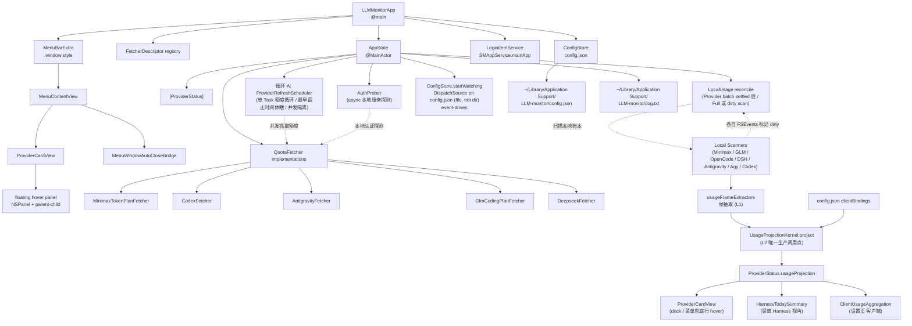

# Runtime — 启动、调度与运行时模型

App 的运行期行为：组件接线图、启动流程、刷新调度、provider 状态机、本地认证探测、UI 广播、数据模型、健康度算法、错误兜底与 provider 注册契约。配置字段契约不在本文件，见 `config.md`；token 计量口径见 `accounting.md`。

## Architecture



## Startup Flow

1. `LLMMonitorApp.init()` acquires the per-user `instance.lock`; a second instance exits without touching shared state.
2. `LLMMonitorApp.init()` creates `ConfigStore`.
3. `ConfigStore` creates the app support directory if needed.
4. If `config.json` is missing, `ConfigStore.writeTemplate(to:)` writes the built-in template.
5. `ConfigStore` loads JSON into `AppConfig`; if an existing file cannot be decoded, it is backed up as `config.json.corrupt-*.json` before recovery continues with `.default`.
6. `LLMMonitorApp.makeDescriptors()` registers the built-in providers.
7. `ConfigStore.ensureProvidersPresent(descriptors:)` adds missing provider blocks without overwriting existing blocks.
8. `LoginItemService` snapshots the current launch-at-login status from `SMAppService.mainApp`.
9. `AppState` derives `ProviderStatus` values from descriptors plus config.
10. `AppState.start()` registers each enabled provider with usable auth in `ProviderRefreshScheduler` — a single long-lived Task that wakes on the earliest due date and runs due refreshes concurrently (no per-provider timer).
11. `AppState.start()` calls `ConfigStore.startWatching()`, which opens the **`config.json` file itself** via `open(O_EVTONLY)` and installs a `DispatchSource.makeFileSystemObjectSource` listener (`eventMask` = `.write / .delete / .rename / .revoke`) — config edits trigger a debounced, event-driven reload in milliseconds (no polling). Directory-level watching is deliberately avoided: `log.txt` and `last-refresh.json` sit in the same directory and would fire a reload on every log line and every timestamp write. An editor's atomic replace (delete + rename) reopens the fd on the old inode's death, and a briefly-missing file is retried with backoff.

The lifecycle delegate calls `AppState.stop()` during normal application termination
and triggers `AppState.handleSystemWake()` after `NSWorkspace.didWakeNotification` —
a merged protocol: the wake refresh joins the global refresh transaction (an external job
already in flight absorbs it as `pendingWakeup` instead of a second transaction) and does
**not** re-anchor per-provider schedules,
so sleep/wake does not leave quota cards stale until the next configured timer tick.
Sleep health is refreshed at startup and wake, and the same deadline driver also schedules
a five-minute health boundary, so newly acquired sleep assertions or AC power changes
are reflected without opening Settings or restarting the app.

## Provider State Machine

```swift
enum State {
    case notConfigured(reason: String)
    case ready
    case loading(lastSuccess: QuotaInfo?)        // 抓取中,lastSuccess 兜底
    case ok(QuotaInfo)                          // 抓取成功
    case failed(message: String, lastSuccess: QuotaInfo?)
}
```

`State` 自身持有"上次成功数据" —— `.loading(lastSuccess:)` / `.failed(_, lastSuccess:)`
/ `.ok(info)` 三种 case 都能从 `state.lastSuccess` 拿到 QuotaInfo?。**没有**单独的
`_lastSuccess` 字段（之前有过，跟 `.failed.lastSuccess` 重复存，迁 `.ok → .loading →
.ok/.failed` 任意一处忘记更新就会让 UI 跟 `healthLevel` 不一致，已删）。

State derivation is descriptor-driven:

| Situation | State |
|---|---|
| Provider block missing from config | `.notConfigured("未在 config.json 中配置")` |
| `enabled == false` | `.notConfigured("已在 config.json 中禁用")` |
| API-key provider has empty/template key | `.notConfigured("API Key 未填写")` |
| External-auth provider has no local auth file | `.notConfigured("外部 auth 缺失：...")` |
| Antigravity local session missing | `.notConfigured("请先启动 Antigravity 并完成登录")` |
| Config and auth are present | `.ready` |
| Fetch in progress | `.loading(lastSuccess: prev)` |
| Fetch succeeds | `.ok(info)` |
| Fetch fails | `.failed(message, lastSuccess: prev)` |

`rebuildStatuses` 在 config 变更时被调用。如果 deriveState 返回 `.ready`（auth 还 ok），
旧 status 的 `.ok/.loading/.failed` 状态会**整体复用**（auth 没变就不擦数据）；
deriveState 返回 `.notConfigured` 时整个 state 重置，lastSuccess 跟着清。

`rebuildStatuses()` preserves the entire `State` (`.ok/.loading/.failed`) by provider id when auth is still valid (derived is `.ready`), so config reloads do not erase the last successful snapshot. When auth becomes invalid (derived is `.notConfigured`), state resets to `.notConfigured` and the QuotaInfo data is dropped.

## Refresh Behavior

所有 enabled provider 由单一 `ProviderRefreshScheduler` Task 统一调度（无 per-provider timer）：

1. 注册时立即调用 `refreshHandler(providerID, .full)` → AppState 的 `refreshProviderDirectly`
2. 每次唤醒取"最早到期时刻"，到期的 provider 用 TaskGroup 并发刷新（首轮 `.full`，后续轮询用 `.background` mode）
3. 成功后按 `providers.<id>.refreshIntervalSeconds ?? refreshIntervalSeconds` 计算下次到期
4. 失败按同一个 baseInterval 固定间隔随下一定时周期重试（不做指数退避：后台固定间隔刷新下，拉长重试间隔只会推迟恢复）
5. 任务被 cancel → 退出循环

**配置重载 ≠ 冷启动**：配置写盘（设置页保存、dock 拖拽落点 App 自写 config、auth 探测翻转）触发的重排走 `ProviderRefreshScheduler.reconfigure(managed:)` 差异化路径——仍启用且 interval 未变的 provider 原样保留既有 deadline 与首刷标记（下一拍继续 `.background`），只有新增 / 重新启用 / interval 变化的 provider 才按初始排期立即纳入；冷启动语义只属于 `AppState.start()`。

**周期 full（reset credits 等“只在 full 抓取”的字段）**：`ProviderRefreshScheduler` 每累计
`periodicFullEveryN`（默认 20）次 `.background` 后，下一次补跑一次 `.full`（走常规 deadline，
不改变常规排期节奏）。这样 Codex 的 reset credits 不需要用户手动刷新也能周期性更新：默认 300s 间隔下
约每 `20×300s ≈ 100min` 自动 full 一次。`.background` 仍只抓主 quota，不抓 reset credits。

scheduler 集中持有排期与 in-flight 状态：`nextRefreshDates` / `midCycleDeadlines` / `inFlightModes` / `inFlightWaiters` 等。
in-flight dedup：`markInFlight(providerID)` 返回 false 时直接 `.deferred`（已被 timer /
manual / menu-open 任一路径占住）。手动 full refresh 若遇到 background 请求，会通过
`waitUntilNotInFlight` 等待；该等待支持 cancellation，取消时会移除带 UUID 的 waiter，
不会留下悬挂 continuation。多个 full refresh waiter 由 `pendingFullRefreshIDs` 做一次性
claim，当前 background 请求完成后最多补跑一次 full refresh。
成功与失败都直接按 baseInterval 写入 `nextRefreshDates`。
UI 通过 `earliestNextRefresh` 拿到所有 provider 中最早的下次触发时间，pub 到 `nextRefreshAt`。

`AppState.refreshProviderDirectly` 是 scheduler 的 refreshHandler 闭包：
1. 入口 `markInFlight` dedup，失败 `.deferred` 退出
2. fetch + 应用到 `statuses[idx]` + 通知 `statusDidChange` 广播
3. `defer { markNotInFlight }` 在 `await` 路径任何退出都执行
4. 失败时只记录 `.failed` 状态 + antigravity 走 `AuthProber.scheduleProbe` 重新探测（排期仍按 baseInterval）
5. config 变更时 generation mismatch 直接丢弃旧结果

The `effectiveRefreshInterval(for:)` helper clamps the interval to `10s...30d` to prevent
busy loops from typos (`0` or negative) and integer-conversion overflow from extreme values
in `config.json`.

Manual refresh paths:

| UI action | Method |
|---|---|
| Header refresh button | `AppState.refreshAll()` |
| Card context menu "立即刷新" | `AppState.refreshOne(providerID:)` |
| Menu open with any `.ready` provider | `MenuContentView.onAppear` triggers `refreshAll()` |
| Right-click menu bar icon | `MenuBarRightClickHandler.refreshClicked` |

`refreshAll()` starts one child task per refreshable provider. `ProviderRefreshScheduler.markInFlight`
deduplicates so timer + manual + menu-open fire on the same provider collapse to a
single in-flight request. Status mutations remain on the main actor; network waits are
asynchronous.

Config reload path:

1. `ConfigStore.startWatching()` opens the `config.json` **file** and installs a
   `DispatchSource.makeFileSystemObjectSource` listener; `AppState.start()` is its
   only caller.
2. Each event first schedules a 250 ms debounce, then reads the file on a detached
   utility task and calls `configStore.hasChangedSinceLastRead(using:)`; an
   unchanged fingerprint short-circuits without parsing.
3. If parsing succeeds, `ConfigStore` publishes the new config, AppState
   increments `configurationGeneration`, statuses rebuild, and all provider timers
   reschedule.
4. In-flight fetches captured the *previous* `configurationGeneration`; when they
   complete, the captured value is compared and stale results are dropped.
5. If parsing fails during reload, `ConfigStore` keeps the previous config.

## Per-Provider Result Merge

每个 fetcher 自带 `resultMerger: RefreshResultMerger` —— policy 跟 fetcher domain knowledge
放一起，AppState 不再写 `if kind == .minimaxTokenPlan { ... }` 之类的分支：

| Fetcher | Merger | Behavior |
|---|---|---|
| `MinimaxTokenPlanFetcher` | `IdentityRefreshResultMerger`（默认） | 直接用新值。历史上的 `MinimaxVideoPreservingMerger`（`.background` 模式沿用上次 video 条目）已删除 |
| `CodexFetcher` | `CodexFillingMissingMerger` | `resetCredits` / `codexUsageDetails` 缺失时回退到上次（避免 UI 空白）；reset credits 有独立新鲜度——`.background` 按设计跳过时保留原值与原时间，`.full` 抓取失败时保留旧值并标记「可能过期」，恢复成功清除 |
| `AntigravityFetcher` / `GlmCodingPlanFetcher` / `DeepseekFetcher` | `IdentityRefreshResultMerger`（默认） | 直接用新值 |

`CodexFetcher` 是当前**唯一**自带 merger 的 fetcher（`let resultMerger: RefreshResultMerger = CodexFillingMissingMerger()`）；其余走 `QuotaFetcher` 的默认实现。

AppState.fetch 成功后调 `fetcher.resultMerger.merge(new:previous:mode:)` 合成最终值。

## Auth Probing

Antigravity 是用本地 Antigravity / agy CLI 的 `language_server`，进程可能中途崩。
`AuthProber` 异步探测 `fetcher.checkLocalAuth()` 并缓存结果：

- `scheduleProbe(for: providerID)`：启动探测（fetcher.hasLocalAuth() false 时不发）
- `markAvailable(providerID)`：refresh 成功路径直接标记可用
- `isUnavailable(providerID)`：用于 `rebuildStatuses` 派生 `.notConfigured("请先启动 Antigravity...")`
- `reset()`：config 变更时清空 cache + 取消所有 in-flight
- `cancelAll()` / `cancel(providerID:)`：stop / schedule 同 provider 前的清理

`onChange` 回调在 cache 值变化时触发，AppState 收到 `false` 立刻 `rebuildStatuses + rescheduleAll`
让 UI 立即显示离线提示；`true` 不在 callback 里 rebuild（依赖下次 refresh 成功后的 markAvailable）。

## UI Event Broadcasting

`AppState.statusDidChange: PassthroughSubject<Void, Never>` 是统一的广播通道。
所有"改 statuses 数组"或"改 status[idx] 局部字段"的入口（`mutateStatus` / `rebuildStatuses` /
`setScanningState` / `apply*LocalUsage`）都 fire 一次，MenuBarExtra 上挂一个
`.onReceive(state.statusDidChange) { _ in }` 即可绕开 MenuBarExtra 的 view 缓存。

`mutateStatus(at:_:)` 用 "copy array → modify → assign once" 模式：
赋值触发 `@Published` willSet 自动 send `objectWillChange`，加上手动 `statusDidChange.send()`
走显式 publisher 通道，两路保险。之前是 `objectWillChange.send() + in-place mutation` +
3 个独立 PassthroughSubject（`antigravityUsageDidChange` / `minimaxUsageDidChange`），已合并。

## Launch At Login

The Settings panel includes a launch-at-login toggle backed by `SMAppService.mainApp`. The menu footer displays read-only status text (`自启 ✓` / `自启 ✗`).

Behavior:

| Situation | UI text |
|---|---|
| Registered | `已开启开机自启动` |
| Not registered, app in `/Applications` | `可开启开机自启动` |
| Not registered, app outside `/Applications` | `建议放到 Applications 后再开启` |
| Registered but blocked by system approval | `需要在系统设置中批准登录项` |
| Service not found / unsupported runtime | `当前环境暂不支持开机自启动` |

Implementation notes:

- This works best from a packaged `.app`, especially when the bundle lives in `/Applications`.
- The toggle does not write to `config.json`; it talks directly to the system login-item service.
- Registration failures are shown in the Settings panel and written to `log.txt`.

## Data Model

`QuotaInfo` is provider-neutral:

| Field | Meaning |
|---|---|
| `models` | One or more `ModelQuota` rows shown in the card |
| `resetCredits` | Optional ChatGPT/Codex reset-credit details |
| `planLabel` | Optional plan label, currently parsed from Codex `id_token` |
| `accountEmail` | Optional logged-in account. Only Antigravity provides it; other providers leave it nil (the card's Account Info row visibility is decided solely by `QuotaWindowAccountInfo.make`) |
| `codexUsageDetails` | Optional local 5h / weekly token summary for Codex |
| `balanceDetail` | Optional structured DeepSeek balance breakdown (`DeepseekBalanceDetail`); replaced the preformatted string that used to be stuffed into `accountEmail`. Always nil for other providers |
| `fetchedAt` | Successful fetch timestamp |

`ModelQuota` carries two quota windows:

| Window | Fields |
|---|---|
| 5-hour / interval | `intervalTotalCount`, `intervalUsageCount`, `intervalRemainingPercent`, `intervalStatus`, `intervalResetsAt`, `intervalWindowSeconds` (optional; ChatGPT/Codex 等动态窗口) |
| Weekly | `weeklyTotalCount`, `weeklyUsageCount`, `weeklyRemainingPercent`, `weeklyStatus`, `weeklyResetsAt`, `weeklyWindowSeconds` |

`intervalStatus` and `weeklyStatus` use the shared `QuotaWindowStatus` type:
`.present` means that the provider exposed the window, including an exhausted `0%` window;
`.absent` means that the window is missing or unavailable. Provider-specific raw status codes
are normalized at each fetcher boundary and must not leak into shared UI or health logic.

The current UI emphasizes reset time and remaining percent. Token totals are preserved in the model but are often `0` for percent-only APIs. Codex additionally computes local token usage summaries from `~/.codex/sessions` and `~/.codex/archived_sessions`.

### OpenCode merge data

`OpencodeLocalUsage` stores one `OpencodeProviderUsage` per OpenCode `providerID`.
Each slice contains today's `OpencodeDailyUsage`, seven local calendar days, a
tokenized assistant-message `roundCount`, and recent samples. The four card switches
are applied at the view-state boundary:

- off: keep the native/local card source unchanged;
- on: add the matching OpenCode slice field by field;
- samples: prefix OpenCode prompt IDs before concatenation so native and OpenCode
  turns cannot collide;
- ChatGPT: convert OpenCode uncached input plus cache read into Codex's complete
  `inputTokens` / `cachedInputTokens` representation before addition.

OpenCode rounds count tokenized assistant messages. Turns count distinct
`COALESCE(parentID, message.id)` values per day. The scanner pads the seven-day window
and rebases it after midnight even when the database fingerprint has not changed.

## Health Algorithm

Health is computed from remaining percent:

```swift
if percent < 15 { .critical }
else if timeFraction == nil && percent < 30 { .warning } // 5h / short window
else if let timeFraction, percent < min(timeFraction * 100, 50) { .warning } // weekly
else { .healthy }
```

`ModelQuota.colorLevel` is the single source of truth for both health and progress-bar
colors. Short windows use a fixed 30% warning threshold; long windows use the smaller
of the remaining-time percentage and 50%. `ModelQuota.healthLevel` uses the worse of
the interval and weekly windows.
`QuotaInfo.healthLevel` uses the worse model.
`ProviderStatus.healthLevel` returns `HealthLevel?` (optional) and is derived from
`state.lastSuccess?.healthLevel` —— 跟 state 自带的 QuotaInfo? 同步，**不**会
跟 state 里的数据不一致。`stateHasSuccessData` helper 用来判断一个 state
是否带"上次成功数据"（`.ok/.loading/.failed` 都返回 true）。

| State | Health source |
|---|---|
| `.ok(info)` | `info.healthLevel` |
| `.loading(lastSuccess: prev)` | `prev?.healthLevel`（无则 nil） |
| `.failed(_, let last)` | `last?.healthLevel`（无则 nil） |
| `.ready` / `.notConfigured` | `nil`（UI 显示灰点，不归类为"健康"） |

`nil` 让 UI 端的状态胶囊用 secondary 灰色渲染，明确区分"没数据"和"有数据但健康"。菜单栏的 `iconDuo` 仪表盘会随额度指标与节能/睡眠健康度变化；`quotaLogo`（App 图标）是固定设计稿、不随健康度变化；标准 SF Symbol 样式则保留右下角状态点与刷新中的图标替换。卡片状态点和进度颜色同样反映健康度。

## Error And Fallback

On successful fetch:

- state becomes `.ok(info)` (info 自带 QuotaInfo = 之前的 _lastSuccess 角色)
- `lastRefreshedAt` becomes `info.fetchedAt`
- `lastRefreshAt` is set to `Date()`

On failed fetch:

- state becomes `.failed(message, lastSuccess: prev)` (prev 来自上一个 .ok 状态)
- the card shows the error in red
- if `lastSuccess` exists, the old quota is still displayed with reduced opacity

之前用单独的 `_lastSuccess` 字段跟 `.failed.lastSuccess` 重复存 —— 现在
`State` 自身持有 QuotaInfo，迁 `.ok → .loading → .ok/.failed` 不再需要双写。
- `lastRefreshAt` is still updated

Fetcher errors use `QuotaError`:

| Case | User-facing description |
|---|---|
| `missingAPIKey` | `未配置 API Key` |
| `invalidResponse` | `响应格式无效` |
| `httpError(status, body)` | `HTTP <status>: <first 200 chars>` |
| `decodingError(message)` | `解析失败：<message>` |
| `networkError(message)` | `网络错误：<message>` |

Antigravity-specific note:

- The fetcher does not trust stale OAuth tokens in `state.vscdb`.
- It reuses the local authenticated Antigravity `language_server`, discovers its HTTPS port and CSRF token, and reads quota through local RPC endpoints.

## Provider Registration Contract

Adding a provider currently requires:

1. Add a `ProviderKind` case in `Models/ProviderStatus.swift`.
2. Add an `AccentColor` case (if it has a brand color) in the same file.
3. Decide whether `kind.usesExternalAuth` is `true` or `false`.
4. Implement `QuotaFetcher` in `Sources/LLM-monitor/Fetchers/`.
5. Return provider-neutral `QuotaInfo` from `fetch()`.
6. Register a `FetcherDescriptor` (id / displayName / kind / icon / accentColor /
   makeFetcher / settingsTabTitle / settingsTabSubtitle) in
   `LLMMonitorApp.makeDescriptors()`.
7. 在 `SettingsView.providerPane(for:)` 派发里加一个 `case`，写该 provider 的
   设置 UI（默认走"enabled toggle + 独立刷新间隔"通用模板，特殊字段
   如 API Key / authPath 在这里加）。
8. Add or update provider spec under `spec/providers/`.

`ConfigStore.ensureProvidersPresent()` will add a placeholder config block for the new descriptor at the next app start.

**如果新 provider 有本地用量 scanner**（参考 `MinimaxLocalUsageScanner` /
`AntigravityLocalUsageScanner`），额外步骤：

9. 写一个 `XxxLocalUsage: Equatable, Codable, Sendable` 聚合 model（参考
   `MinimaxLocalUsage`），**自定义 `==` 排除 `scannedAt`**（每次扫描都是新 `Date`，
   默认 Equatable 让 no-op 检查形同虚设，触发无意义 UI reload + log spam）。
10. 写一个 `XxxLocalUsageScanner: ObservableObject, LocalUsageScanner<XxxLocalUsage>`
    实现（参考 `MinimaxLocalUsageScanner`），用 `AsyncMutex` + `lastCommittedGeneration`
    串行化 cache 写（防 cache revert）。`LocalUsageScanRunner.run` 抽走了
    lifecycle boilerplate，scanner 只实现 work + defer 块。
11. 在 `AppState` 加一个 `lazy var xxxLocalUsageCoordinator = LocalUsageCoordinator<XxxLocalUsage>(...)`
    （参考 `antigravityLocalUsageCoordinator`），apply 闭包走 `applyLocalUsage<T: Equatable>(kind:field:...)`
    通用函数（**不**要再写镜像的 `applyXxxLocalUsage`）。
12. 本地用量扫描由 `ProviderRefreshScheduler` 的 `onBatchSettled` 驱动：每批 Provider
    请求全部返回后（不论成功/失败）投递一次 `LocalUsageOrchestration` reconcile。
    **reconcile 每拍都跑**，不是只在 FSEvents 报 dirty 时才跑：常规档是 `.full`
    （cache-assisted），由各 scanner 自己的 fingerprint 决定复用缓存还是真扫；
    `.hardFull`（绕过 fingerprint / offset / cache）只在启动首拍、日历签名失效
    （`LocalUsageCalendarSignature`）和 `bypassesProviderCache` 时触发。请求按
    `dirty < full < hardFull` 折叠，FSEvents / vnode dirty 只是把该拍标成 `.dirty`
    的一个来源。即使 Provider 全部禁用，调度器也会完成一次空 pass，保证首次扫描
    仍能拿到 Provider 流程产出的窗口输入。新客户端需要在自己的 scanner 内注册
    watcher，并在 `LocalUsageOrchestration.checkClientReadiness` 登记数据源就绪判断。

**已落地案例**：`DeepSeek` 完整走上述 1–8 步（无本地用量 scanner，跳过 9–12），
且是唯一一个 **post-fetch 无副作用** 的 provider（`refreshProviderDirectly` 的
kind 派发链里没有 `.deepseek` 分支）。它的高峰窗口为北京时间周一至周五 9–12 / 14–18
（`DeepseekPeakWindow.defaultWindow`），时段固定不可调；高峰永不含周末，周六、周日
全天平价。详见 [`spec/providers/deepseek.md`](providers/deepseek.md)。

Lookup pattern in the rest of the code:

```swift
descriptors.first(where: { $0.kind == .newProvider })?.id
```

**Runtime single source of truth.** AppState and SettingsView both look up the id
through this path. Two known edges (intentional, not bugs):

1. `ConfigStore.writeTemplate` is a `static` function called before `descriptors`
   is available, so the bootstrap `config.json` template has hardcoded
   `providers.<id>` segments. The runtime `ensureProvidersPresent(descriptors:)`
   follows the descriptor path correctly.
2. `QuotaFetcher.providerID` is a stored property on the fetcher itself, used for
   log tags and self-identification. It is the same string as the descriptor id,
   but stored locally because the fetcher is a `Sendable` value that may be used
   independently of the registry.

**SettingsView 派生 tab**（不是硬编码）：`SettingsTab` 是 `.general` + `.provider(FetcherDescriptor)`
的 enum。`SettingsView.allTabs` 直接 `[.general] + descriptors.map { .provider($0) }`，
侧栏 icon / 标题 / 副标题从 descriptor 拿，**新增 provider 不用改 `SettingsTab` 枚举本身**。
`providerPane(for: ProviderKind)` 是 kind 派发，加新 provider 在那里加一个 `case` 写
pane UI（默认模板：enabled toggle + 独立刷新间隔；特殊字段如 API Key / authPath
在 case 里加）。`SettingsPaneHeader` 也走同一个 `SettingsTab`，不再 hardcoded icon / title。

## Current Design Boundaries

These are documented product boundaries:

- Local usage scanners restore their last-good `index.json` snapshot on cold start; the
  remote quota refresh timestamp is persisted separately in `last-refresh.json`.

菜单栏图标样式（`chart.bar.fill` / `quotaLogo` / `iconDuo`）与菜单 70% 高度上限的产品边界已并入 `ui/menu-and-cards.md`（§Menu Bar Item / §Window Structure）。

- The local-usage day bucket is now **two structs, not N**: `LocalDailyTokenUsage`
  (`Models/LocalDailyTokenUsage.swift`) is the single shared implementation, and
  `AntigravityDailyUsage` / `MinimaxDailyUsage` / `GlmDailyUsage` /
  `OpencodeDailyUsage` / `DshDailyUsage` / `AgyDailyUsage` are `typealias`es of it;
  `DailyTokenUsage` (`Models/QuotaInfo.swift`) is the only other struct, kept for
  Codex's on-disk JSON key compatibility. Both conform to `LocalUsageDaily`, so view
  code is generic over the protocol while the per-source fields stay where they are.
  This counts **2 chart data types**, not 2 scanners: OpenCode / DSH / GLM-ZCode
  have their own SQLite readers, Antigravity is pure RPC, and Codex parses JSONL on
  demand for the 7-day chart.

> 核对基线：2026-10-05 · 代码 d2ef5ed
